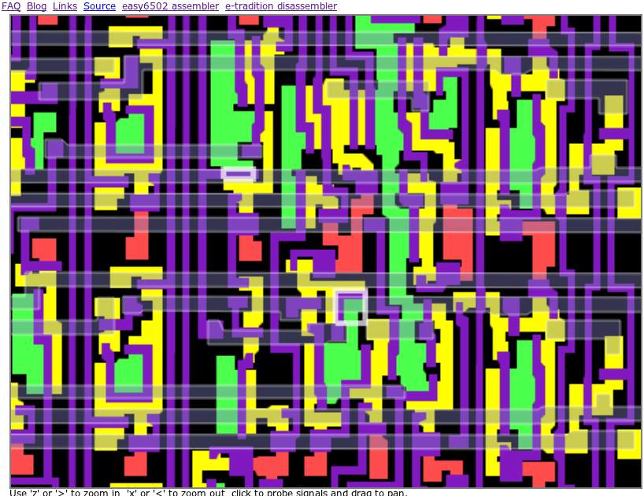
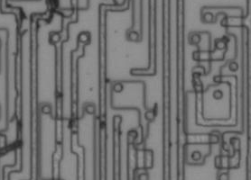
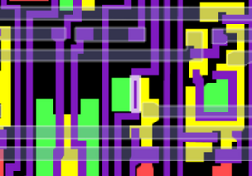

**INCOMPLETE DRAFT OF RECOVERED WIKI PAGE**

# 6502DecimalMode - VisualChips


	

	
	


## 6502DecimalMode


	

		


#### From VisualChips


		

		

		

The 6502 had a couple of unique selling points compared to its predecessor the 6800, and the decimal mode was crucial because it was patent protected. It saves an instruction and a couple of cycles from each byte of decimal arithmetic, and removes the half-carry from the status byte - it also works for both addition and subtraction.


Decimal mode only affects ADC and SBC instructions, and on the NMOS 6502 only usefully sets the C flag. The N, V and Z flags are set, but don't correspond to what you might expect from a 10's complement decimal operation.


Nonetheless, all four flags are set, so it's worth understanding how they are set, and why. (See 
[Ijor's paper](http://www.atariage.com/forums/topic/163876-flags-on-decimal-mode-on-the-nmos-6502), and 
[Bruce Clark's tutorial](http://www.6502.org/tutorials/decimal_mode.html))


Many (software) emulators have decimal mode correct, and many have it incorrect or missing. The same is true for 
[various re-implemented 6502 cores](http://forum.6502.org/viewtopic.php?t=1673). Because the CMOS 6502 and later parts set the flags differently from the NMOS 6502, correctness can only be judged relative to a specific part.


Bruce Clark's tutorial contains a test program which can test all the flags (for the various CPU models) and will report the first failing case.  Using this, we can collect some specific 'difficult' cases for use on a slow model, or for a rapid test of new code, or for illustration of the 6502 datapath in action.  Some of the following tests are now found in the 
[py65 test suite](https://github.com/mnaberez/py65/tree/master/src/py65/tests/devices)

We need a list of interesting signals to probe to observe the decimal mode adjustments. (The presently released JSSim doesn't have C34 named, but it will on next update)


The two operands, and the carry in, are added as a pair of nibbles. The carry-out from bit3 is adjusted in decimal mode, but only for ADC. So the ALU is not a binary byte-wide ALU with a decimal adjustment, it is a pair of binary nibble ALUs with a decimal adjustment.  In the tests, we don't specifically need to test that carry-in is used (except to prove that carry-out is changing the carry bit, if we have that freedom)


Some of the tests below are found in Bruce Clark's 
[V flag tutorial](http://www.6502.org/tutorials/vflag.html#b). Others are taken from failing cases when running his 
[decimal mode test suite](http://www.6502.org/tutorials/decimal_mode.html#B).


(For other test suites, see 
[6502TestPrograms](index.php?title=6502TestPrograms))


### Contents


- [1 Tests for ADC](#tests-for-adc)
- [2 Tests for SBC](#tests-for-sbc)
- [3 Decimal mode and the NES' RP2A03G](#decimal-mode-and-the-nes.27-rp2a03g)
- [4 References](#references)

####  
 Tests for ADC 


-  00 + 00 and C=0 gives 00 and N=0 V=0 Z=1 C=0 (
[simulate](http://visual6502.org/JSSim/expert.html?graphics=f&steps=30&a=0&d=a9c848a900286900ea08aa6849c2ea))

-  79 + 00 and C=1 gives 80 and N=1 V=1 Z=0 C=0 (
[simulate](http://visual6502.org/JSSim/expert.html?graphics=f&steps=56&a=0&d=a90f48a979286900ea08aa6849c2ea))

-  24 + 56 and C=0 gives 80 and N=1 V=1 Z=0 C=0 (
[simulate](http://visual6502.org/JSSim/expert.html?graphics=f&steps=56&a=0&d=a90a48a924286956ea08aa6849c2ea))

-  93 + 82 and C=0 gives 75 and N=0 V=1 Z=0 C=1 (
[simulate](http://visual6502.org/JSSim/expert.html?graphics=f&steps=56&a=0&d=a98e48a993286982ea08aa6849c2ea))

-  89 + 76 and C=0 gives 65 and N=0 V=0 Z=0 C=1 (
[simulate](http://visual6502.org/JSSim/expert.html?graphics=f&steps=56&a=0&d=a9fe48a989286976ea08aa6849c2ea))

-  89 + 76 and C=1 gives 66 and N=0 V=0 Z=1 C=1 (
[simulate](http://visual6502.org/JSSim/expert.html?graphics=f&steps=56&a=0&d=a9fd48a989286976ea08aa6849c2ea))

-  80 + f0 and C=0 gives d0 and N=0 V=1 Z=0 C=1 (
[simulate](http://visual6502.org/JSSim/expert.html?graphics=f&steps=56&a=0&d=a9ba48a9802869f0ea08aa6849c2ea))

-  80 + fa and C=0 gives e0 and N=1 V=0 Z=0 C=1 (
[simulate](http://visual6502.org/JSSim/expert.html?graphics=f&steps=56&a=0&d=a97e48a9802869faea08aa6849c2ea))

-  2f + 4f and C=0 gives 74 and N=0 V=0 Z=0 C=0 (
[simulate](http://visual6502.org/JSSim/expert.html?graphics=f&steps=56&a=0&d=a9fe48a92f28694fea08aa6849c2ea))

-  6f + 00 and C=1 gives 76 and N=0 V=0 Z=0 C=0 (
[simulate](http://visual6502.org/JSSim/expert.html?graphics=f&steps=56&a=0&d=a9ff48a96f286900ea08aa6849c2ea))


####  
 Tests for SBC 


-  00 - 00 and C=0 gives 99 and N=1 V=0 Z=0 C=0 (
[simulate](http://visual6502.org/JSSim/expert.html?graphics=f&steps=56&a=0&d=a94e48a90028e900ea08aa6849c2ea))

-  00 - 00 and C=1 gives 00 and N=0 V=0 Z=1 C=1 (
[simulate](http://visual6502.org/JSSim/expert.html?graphics=f&steps=56&a=0&d=a9c948a90028e900ea08aa6849c2ea))

-  00 - 01 and C=1 gives 99 and N=1 V=0 Z=0 C=0 (
[simulate](http://visual6502.org/JSSim/expert.html?graphics=f&steps=56&a=0&d=a97f48a90028e901ea08aa6849c2ea))

-  0a - 00 and C=1 gives 0a and N=0 V=0 Z=0 C=1 (
[simulate](http://visual6502.org/JSSim/expert.html?graphics=f&steps=56&a=0&d=a9cb48a90a28e900ea08aa6849c2ea))

-  0b - 00 and C=0 gives 0a and N=0 V=0 Z=0 C=1 (
[simulate](http://visual6502.org/JSSim/expert.html?graphics=f&steps=56&a=0&d=a9ca48a90b28e900ea08aa6849c2ea))

-  9a - 00 and C=1 gives 9a and N=1 V=0 Z=0 C=1 (
[simulate](http://visual6502.org/JSSim/expert.html?graphics=f&steps=56&a=0&d=a94b48a99a28e900ea08aa6849c2ea))

-  9b - 00 and C=0 gives 9a and N=1 V=0 Z=0 C=1 (
[simulate](http://visual6502.org/JSSim/expert.html?graphics=f&steps=56&a=0&d=a94a48a99b28e900ea08aa6849c2ea))

One form of test program sets all the input flags using PLP:


```
lda #$c8
pha
lda #$00
plp
adc #$00
nop

```

and to calculate what that initial value of PLP should be, we can use a bit more code


```
php
pla
eor #$c3   // #$c2 if we don't want to invert the carry
nop

```


####  
 Decimal mode and the NES' RP2A03G 


The CPU in the NES' RP2A03G does not implement decimal mode for ADC and SBC operations, but it does correctly handle the setting and clearing of the D flag.


In 
[this blog post](http://metopal.com/2012/02/12/famicom-brain/) by Nathan Altice, Brian Bagnall’s "On the Edge: The Spectacular Rise and Fall of Commodore (2006)" is quoted:


[Commodore 64 programmer] Robert Russell investigated the NES, along with one of the original 6502 engineers, Will Mathis. “I remember we had the chip designer of the 6502,” recalls Russell. “He scraped the [NES] chip down to the die and took pictures.”

The excavation amazed Russell. “The Nintendo core processor was a 6502 designed with the patented technology scraped off,” says Russell. “We actually skimmed off the top of the chip inside of it to see what it was, and it was exactly a 6502. We looked at where we had the patents and they had gone in and deleted the circuitry where our patents were.”

With visual6502 and images from Quietust's investigation of the 2A03 we can see that a small number of changes, only to the polysilicon mask, disable the decimal adjustment by removing 5 transistors.  When poly shapes are deleted, the former source and drain of transistor become contiguous, so the effect is of shorting the transistor, or making it permanently on. (These are pulldown transistors, and it's normal for them to be on, although they would typically have a 10k resistance.  Shorting them will cause some additional power dissipation from the corresponding pullup but presumably insignificant compared to the thousands of other pullups which will be active at any give time.)


The first note of the difference is this odd contact cut which has no surrounding poly or active: see 
[this image](http://uxul.org/~noname/chips/strange-via-1.png) - which turns out to be due to the removal of 
[the t1329 transistor](http://visual6502.org/JSSim/expert.html?nosim=t&find=t1329&panx=289.2&pany=446.7&zoom=12.4).  It's one of two transistors normally used by the 
["dpc22\_#DSA"](http://visual6502.org/JSSim/expert.html?nosim=t&find=dpc18_~DAA&panx=257.4&pany=417.3&zoom=2.4) signal as a pulldown to effect decimal adjust during subtraction. The other is 
[t3212](http://visual6502.org/JSSim/expert.html?nosim=t&find=t3212,t1329&panx=287.0&pany=437.6&zoom=12.4) which is just off the top of the two images linked above.




  

Transistors t3212 and t1329 in visual6502


The corresponding adjustment for ADC 
[(dpc18\_#DAA)](http://visual6502.org/JSSim/expert.html?nosim=t&find=dpc18_~DAA&panx=257.4&pany=417.3&zoom=2.4) affects three transistors: 
[t2750, t2202, t2556](http://visual6502.org/JSSim/expert.html?nosim=t&find=t2750,t2202,t2556&panx=249.9&pany=456.7&zoom=5.0)

In the case of t2556 the control line runs through the transistor - but still the poly is removed locally with a minimal change. That leaves some floating poly, but as the other two transistors don't exist any more, it's irrelevant.




  

Transistor t2556 in NES 2A03




  

Transistor t2556 in visual6502


With these 5 transistors removed, there was no need to change the decode ROM and no need to change the status register.


####  
 References 


-  
[Post](http://forums.nesdev.com/viewtopic.php?t=2828) "What Commodore Found in the NES" on NESdev forum

-  
[Blog post](http://metopal.com/2012/02/12/famicom-brain/) "Whence Came the Famicom’s Brain?" by Nathan Altice

-  
[2A03 chip images](http://www.qmtpro.com/~nes/chipimages/#rp2a03) on Quietus' reverse-engineering site


