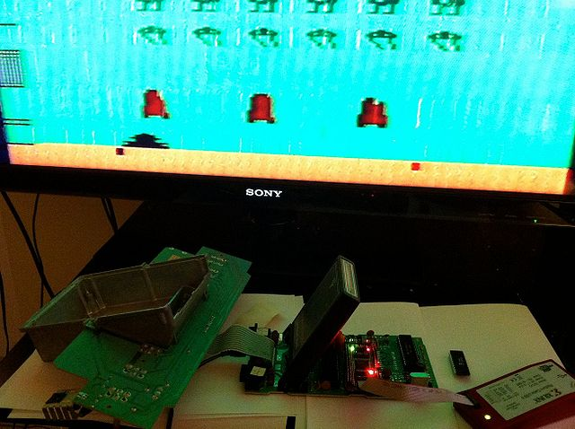
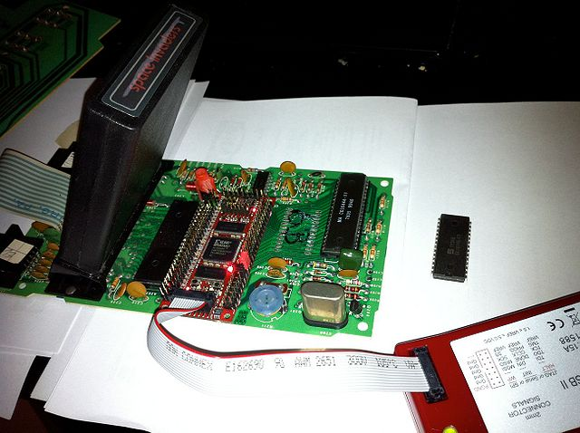
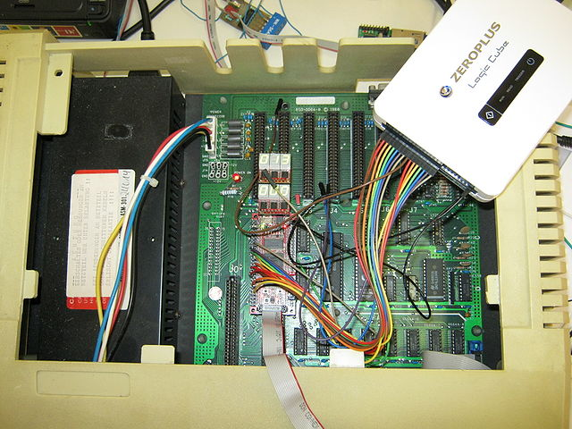
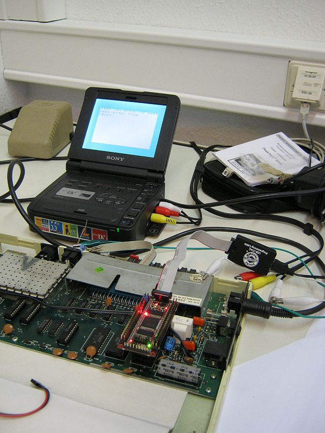
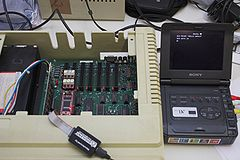
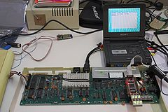
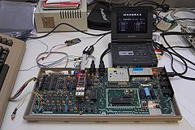

**INCOMPLETE DRAFT OF RECOVERED WIKI PAGE**

# 6502 - simulating in real time on an FPGA - VisualChips

## 6502 - simulating in real time on an FPGA

#### From VisualChips
**Contents**

- [Introduction](#introduction)
- [Simulating in software](#simulating-in-software)
- [Simulating in hardware](#simulating-in-hardware)
- [Passing a test suite](#passing-a-test-suite)
- [Further work](#further-work)
- [Resources](#resources)

#### Introduction

In September 2010 the visual6502 project released the [JavaScript simulator](http://www.visual6502.org/JSSim/expert.html?steps=10), which ran a chip animation at about one clock cycle per second - a million times slower than the original 6502 - in a web browser.

In fact the transistor level model had already run faster than that, at about 55Hz, as a python implementation (as yet unreleased.) One major difference there is that the graphics animation was done with OpenGL, much faster than JavaScript's Canvas.

But to run a test suite, or any demo program or normal game or application, it's desirable to run much faster. It's even more desirable to run at real time, especially if it's possible to interact with original hardware.

#### Simulating in software

The original bring-up (see [presentation](http://visual6502.org/downloads.html)) was in a simulated Atari context, and the accuracy of the simulated video output was a useful clue to the correctness of the simulation. But it was not real time.

By January 2011 the browser wars had produced faster browsers, we had significantly improved our code, and we'd also released an expert mode which didn't update a chip animation. The result was an in-browser simulation which could run at 250Hz or better.

But in the meantime, only a week or so after the release of the browser version, [Michael Steil](http://www.pagetable.com/?p=517) and some collaborators had ported the code to C and were able to run at about 1kHz - they could run up the "COMMODORE 64 BASIC V2" banner within about 10 seconds (but skipping the memory test.)

This was only a thousand times slower than the original, running on a computer that was perhaps two million times faster.

All of the simulators mentioned so far - in python, JavaScript, and C - are switch-level. They model each pull-down transistor in the circuit and each pass transistor, with some special handling for pullups. The circuit is re-evaluated after each input signal change until it stabilises, which takes several iterations because transistors act bidirectionally. Each signal in the circuit is modelled as high, low or floating.  It's possible that this simple model will need to be revised as we tackle chips with more subtle circuits, but it seems good enough for 6502.

#### Simulating in hardware

From November 2010, Mike J had started a project to convert the transistor-level netlist into a higher-level RTL description, which is presently working in simulation but is not yet published.

From mid-December, Peter Monta has been working on a [project](https://github.com/pmonta/FPGA-netlist-tools) to convert the transistor-level netlist into a synthesisable form which can be placed on an FPGA and run in-circuit.  Most of the chip is converted to logic gates and storage elements, and the remainder is simulated with a 6-bit model of node voltages and edge currents (using approximately 48 levels during simulation.) So the FPGA is clocked at 50MHz or thereabouts, and manages to simulate a 6502 or 6507 at 1MHz or just above.

Note that this verilog design will run at about 4kHz when simulated with the open-source verilator simulator - which is therefore the fastest model available to date.

In January 2010 user Xor on the 6502.org forum [finalised](http://forum.6502.org/viewtopic.php?t=1747) a verilog model of 6502 which was informed by the transistor netlist found in visual6502, but written by hand as a high level document of the function. On the 18th he published a [video](http://youtu.be/b7O7QJsaHHk) of a starfield demo, running at 1MHz. Some code is published on the forum but there's no public release yet.

By late January 2010 Peter had his model running Space Invaders, on an OHO FPGA module replacing the 6507 in an original Atari 2600 console.

[(Link to larger image)](index.php-title-File-6507-demo0.jpg.md)

[(Link to larger image)](index.php-title-File-6507-demo1.jpg.md)

#### Passing a test suite

Since then, Peter has made further improvements, and Ingo Korb has [joined in](https://github.com/ikorb/FPGA-netlist-tools), and run [Wolfgang Lorenz' testsuite](index.php-title-6502TestPrograms.md) in a 1541 disk drive, passing all legal opcodes and failing on 16 unsupported opcodes.  (It is expected that a simulated digital model will not behave precisely as a physical CPU when it comes to these deservedly unsupported opcodes - they cause [essentially analogue behaviour](index.php-title-6502_Opcode_8B_~XAA~_ANE~.md). It's also true that the FPGA module does not behave, electrically, precisely like an NMOS part.)

Ingo has also had success running on FPGA in real time as a CPU replacement in other systems: an Apple IIe clone, VIC20, C64. Ingo has implemented a manual tuning system for the clock delay. (The Apple II Europlus was an unsuccessful experiment - it is thought that the clock skew compensation cannot deal with the slow RAM access times.)

[(Link to larger image)](index.php-title-File-6502-fpga-apple2-img_0040.jpg.md)

[(Link to larger image)](index.php-title-File-6502-fpga-vic20-img_0039.jpg.md)

More pictures, showing functioning vintage software (click through for full size):

[(Link to larger image)](index.php-title-File-6502-fpga-apple2-overview-IMG_1086.jpg.md)

[(Link to larger image)](index.php-title-File-6502-fpga-vic20-overview-IMG_1081.jpg.md)

[(Link to larger image)](index.php-title-File-6502-fpga-c64-overview-IMG_1080.jpg.md)

#### Further work

Work continues on stability and on the maximum speed of the FPGA model. For this to work at all, the model running on the FPGA has to mimic the delays, especially of the clock signals, as well as the CPU logical behaviour.  The FPGA module has to be electrically compatible with the motherboard, including delays, voltage levels and possibly in some cases edge rates.

#### Resources

- [verilator](http://www.veripool.org/wiki/verilator), a fast open-source verilog simulator
- [Xor's thread](http://forum.6502.org/viewtopic.php?t=1747) on 6502.org forum
- [original FPGA-netlist-tools project](https://github.com/pmonta/FPGA-netlist-tools) on github
- [Ingo's fork](https://github.com/ikorb/FPGA-netlist-tools) of FPGA-netlist-tools project, for apple2, C64, VIC20
- [OHO FPGA modules](http://www.google.co.uk/search?q=GODIL40_XC3S250E)
- [Enterpoint's FPGA modules](http://enterpoint.co.uk/shop/en/48-craignell1.html)

Retrieved from "[http://visual6502.org/wiki/index.php?title=6502\_-\_simulating\_in\_real\_time\_on\_an\_FPGA](index.php-title-6502_-_simulating_in_real_time_on_an_FPGA.md)"

