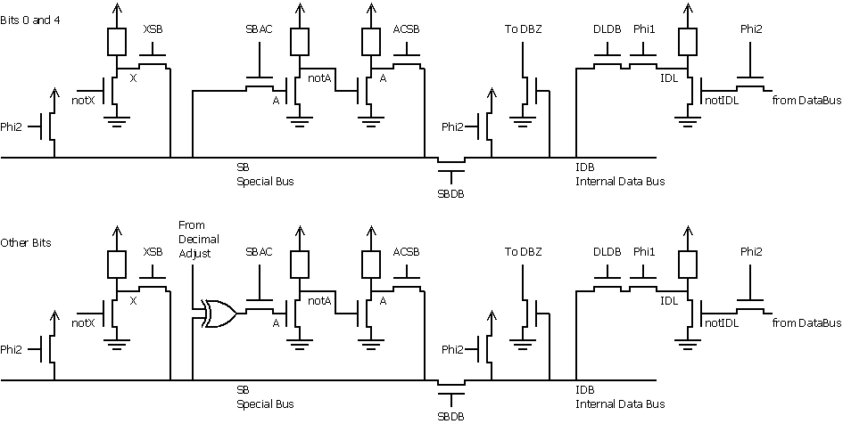

**INCOMPLETE DRAFT OF RECOVERED WIKI PAGE**

# 6502 Opcode 8B (XAA, ANE) - VisualChips


	

	
	


## 6502 Opcode 8B (XAA, ANE)


	

		


#### From VisualChips


		

		

		

Of all the unsupported opcodes, 8B has had a lot of attention because it seems unpredictable. Even the same computer has been seen to act differently even with the same inputs.


### Contents


- [1 Explanation](#explanation)
- [2 Circuit Diagram](#circuit-diagram)
- [3 Testing this opcode](#testing-this-opcode)
- [4 Modelling this opcode](#modelling-this-opcode)
- [5 Tested CPUs](#tested-cpus)
- [6 Resources](#resources)

###  
 Explanation 


The reason is that this opcode connects the A register to SB (the Special Bus) at both input and output: in a sense, A is both read and written. Unlike the stack pointer, the A register is not designed to do that, and the result is a circuit configuration which behaves in an interesting way.


Note that our switch-level simulation tends to produce wired-AND behaviour: if two logic gates both drive the same wire, then either of them can drive it low.  A real 6502 usually does the same, which is why 8B - often called XAA - will more or less AND together the three inputs: the X register, the A register, and the immediate operand.


Why more or less? Two reasons: the A register is fed back on itself, and because of an interaction with the RDY input.


The A register drives the SB directly, and bits 0 and 4 read SB directly. The other 6 bits read SB through the Decimal Adjust logic, which doesn't affect the logic value but does affect the timing, the logic thresholds and the drive strengths.  Exactly what happens is an analogue problem, not a digital one, so it will depend on the exact model of CPU, the variations of chip manufacture, the power supply and the temperature. We can't even model this without knowing the transistor strengths and having some idea of the transistor parameters - which we can only guess at.


The RDY input is a more digital influence on the outcome. RDY is intended to stall the CPU during read accesses, so it can read from slow memory. As it happens, the 6502 samples the databus on every falling clock edge, and loads the IDL (Input Data Latch), and then drives into the target register. Normally, the final cycle is the one which counts, overwriting the stray external values. In some computers, RDY is used to stall the CPU while the bus is used for DMA, which means the bus contains data such as video data for several cycles, except the last.  In the case of XAA, every cycle's data is ANDed into A, and this is why the final value of A changes even for the same values of operand, X and A.


###  
 Circuit Diagram 


Here's an abridged circuit diagram. Note that bits 0 and 4 have direct A feedback whereas the other bits have indirect feedback. Note that phi1 is when A is written, but the preceding phi2 is when the operand is loaded and the two busses precharged high.





(Logic gate pullups shown as resistors, although in NMOS logic pullups are not usually depletion-mode transistors. They pull up to the positive rail. The pass transistors and precharges cannot pull up to the rail: they drop a threshold voltage. These considerations will affect an analogue analysis.)


###  
 Testing this opcode 


This opcode has 3 bytes of input, supposing that we're not allowing RDY to stall the machine and add more operands. We have a test program which tests 256^3 combinations of inputs and compares the final A and the two affected flags against a model. We also have a few specific combinations we've used to characterise different chips.


-  describe or define the programs here

-  also mention the Java simulation which tests the robustness of the switch simulator results (against the order of evaluation)


###  
 Modelling this opcode 


Mention and link to an emulator code fragment.


The base formula for XAA seens to be:


```
A = (A | magic) & X & imm

```

"magic" defines which bits of A shine through.


###  
 Tested CPUs 


We collect here some results of testing this opcode on various CPUs from different manufacturers and in various computers.


|  manufacturer
 |  type
 |  YYWW
 |  country
 |  markings
 |  on back
 |  device tested in
 |  tester
 |  magic
 |  RDY clears #4
 |  stable*
 |  N,Z flags OK**
 |  notes
 |
|:---:|:---:|:---:|:---:|:---:|:---:|:---:|:---:|:---:|:---:|:---:|:---:|:---:|
|  MOS
 |  6502
 |  7551
 |  USA?
 |  MOS
MCS 6502
5175
 |  ?
 |  KIM-1
 |  Michael
 |  FF
 |  ?
 |  ?
 |  ?
 |  only minimal testing done
 |
|  MOS
 |  6502
 |  8402
 |  Philippines
 |  MOS
6502
0284
 |  PHILIPPINES
IH434564
 |  CBM1541
 |  Michael
 |  EE
 |  ?
 |  yes
 |  ?
 |  this is the chip that came with this disk drive
 |
|  MOS
 |  6502B
 |  8207
 |  Korea
 |  MOS
C01437706
0782
 |  6502
KOREA
5231 07
03-82
 |  CBM1541
 |  Michael
 |  EE
 |  ?
 |  yes
 |  ?
 |  from my Atari 800
 |
|  Rockwell
 |  6502
 |  8228
 |  Mexico
 |  R6502P
R6502-11
8228
 |  R6502F
MEXICO
0737
 |  CBM1541
 |  Michael
 |  FF
 |  ?
 |  yes
 |  ?
 |  Simon's; spare part bought from retailer
 |
|  MOS
 |  6510
 |  8337
 |  ?
 |  MOS
6510CBM
3783
 |  ?
 |  C64
NTSC
250407/REV.B
 |  Michael
 |  FF
 |  no
 |  yes
 |  ?
 |  |
|  MOS
 |  6510
 |  8431
 |  Hong Kong
 |  MOS
6510CBM
3184
 |  HONG KONG
HH265111
 |  C64
NTSC
250407/REV.A
 |  Michael
 |  FF
 |  no
 |  yes
 |  ?
 |  |
|  MOS
 |  8500
 |  8551
 |  ?
 |  MOS
8500R3
5185
 |  ?
 |  C64
PAL
250425/REV.B
 |  Michael
 |  FE
 |  yes
 |  yes
 |  ?
 |  
very
 early 8500
 |
|  MOS
 |  8500
 |  9009
 |  Hong Kong
 |  CSG
8500
0990 24
 |  HONG KONG
HH096205
MP150SG
 |  C64
PAL
250469/REV.B
 |  Michael
 |  FE
 |  yes
 |  yes
 |  ?
 |  very late 6502-like CPU
 |
|  MOS
 |  6502AD
 |  8521
 |  ?
 |  MOS
6502AD
2185
 |  ?
 |  CBM1541
 |  Michael
 |  FF
 |  ?
 |  no
 |  ?
 |  bit #3 of X input gets treated as "bit #3 of X & bit #4 of X" most of the time (depends on A though)
very unstable
1 MHz mode tested, can also do 2 MHz; chip is from a VC1571
 |
|  Pravetz
 |  CM630P
 |  8744
 |  Hungary
 |  (symbol)
CM630P
8744
 |  (none)
 |  CBM1541
 |  Michael
 |  FE
 |  ?
 |  no
 |  yes
 |  bit #4 anomalies
 |
|  Synertek
 |  6502
 |  ????
 |  ?
 |  SY
6502
TODO
 |  ?
 |  CBM1541
 |  Michael
 |  |  |  |  ?
 |  Simon's; yet to test
 |
|  MOS
 |  8502
 |  ????
 |  ?
 |  MOS
8502
TODO
 |  ?
 |  C128D
 |  Michael
 |  |  |  |  ?
 |  yet to test; can do 1 MHz and 2 MHz
 |
|  MOS
 |  6502
 |  ????
 |  ?
 |  MOS
6502
TODO
 |  ?
 |  VC1581
 |  Michael
 |  |  |  |  ?
 |  yet to test; can do 1 MHz and 2 MHz
 |
|  Synertek
 |  SALLY
 |  8323
 |  ?
 |  C014806-03
8323
 |  ?
 |  Atari 800XL
 |  Hias
 |  00
 |  -
 |  yes
 |  yes
 |  |
|  Synertek
 |  SALLY
 |  8320
 |  ?
 |  C014806-03
8320
 |  ?
 |  Atari 800XL
 |  Hias
 |  00
 |  -
 |  almost
 |  ?
 |  40 errors in 256^3 full test
sometimes bit 3 was set
 |
|  Synertek
 |  SALLY
 |  8408
 |  ?
 |  C014806-03
8408
 |  ?
 |  Atari 800XL
 |  Hias
 |  00
 |  -
 |  no
 |  yes
 |  ~150k - 450k errors (1%) in full test
sometimes bit 3 set, for example A=03 X=FF imm=FF results either in 03 or 0B in repeated tests
 |
|  Rockwell
 |  SALLY
 |  8322
 |  ?
 |  C014806-12
11151-12
8322
 |  ?
 |  Atari 800XL
 |  Hias
 |  00
 |  -
 |  no
 |  almost
 |  ~30k - 80k errors (0.2%) in full test
sometimes bit 3 is set, but also bit 2 and 5 were set sometimes
for example A=5F or A=87 resulted in a set bit 3 (quite frequently), bit 5 (less frequently) or bit 2 (least frequent)
only flipping from 0 to 1 observed, no flipping from 1 to 0
flags were wrong 115 times (~7ppm)
 |
|  NCR
 |  SALLY
 |  8737
 |  ?
 |  NCR C014806C-29
F826948 S8737
 |  ?
 |  Atari 800XE
 |  Hias
 |  00
 |  -
 |  yes
 |  ?
 |  |
|  ?
 |  SALLY
 |  ?
 |  ?
 |  C014806-35
(C) ATARI 1980
 |  ?
 |  Atari 65XE
 |  Hias
 |  00
 |  -
 |  no
 |  no
 |  This one is highly unstable and the formula seems to be more like A & X & (imm | 6E)
when the CPU is cold A=FF X=FF imm=00 result in 46, later 66 and then 6E (when the CPU is warm)
bit 0 often flips from 0 to 1, for example A=01 X=01 imm=0C results in 00 or 01 (01 occurring more frequently when the CPU is warm)
Also bit 3 flipping from 1 to 0 was observed with A=09 X=E5 and imm=05 or 41 (result: 00 instead of 08)
also the Z flag is often incorrectly set to 1 when the result is non-zero. N flag seems to be OK.
 |
|  Rockwell
 |  SALLY
 |  8328
 |  ?
 |  C014806-12
11151-12
0579 8328
 |  ?
 |  Atari 130XE
 |  Hias
 |  00
 |  -
 |  yes
 |  ?
 |  |
|  Synertek
 |  SALLY
 |  8324
 |  ?
 |  C014806-03
8324
 |  ?
 |  Atari 600XL
 |  Hias
 |  00
 |  -
 |  yes
 |  ?
 |  |
|  Synertek
 |  SALLY
 |  8321
 |  ?
 |  C014806-03
8321
 |  ?
 |  Atari 600XL
 |  Hias
 |  00
 |  -
 |  no
 |  ?
 |  ~95k errors (0.6%!)(MISSING) in full test, sometimes bit 3 was set
 |
|  Synertek
 |  SALLY
 |  8407
 |  ?
 |  C014806-03
8407
 |  ?
 |  Atari 800XL
 |  Hias
 |  00
 |  -
 |  yes
 |  ?
 |  |
|  Rockwell
 |  ?
 |  8402
 |  Mexico?
 |  R6502AP
R6502-13
8407
 |  ?
 |  BBC Model B
 |  EdS
 |  ?
 |  ?
 |  ?
 |  ?
 |  ?
 |

(*)Note: "stable" means that the formula, the "magic" value and the potential #4 clearing by RDY fully describe the behavior.

(**)Note: N and Z flags are set according to the result of XAA


###  
 Resources 


-  For a list of all opcodes and some explanation of what they do, see 
[6502 all 256 Opcodes](index.php?title=6502_all_256_Opcodes).

-  For notes on other opcodes we've explored in our simulations, see 
[here](index.php?title=6502_Unsupported_Opcodes).

-  VICE notes: 
[64doc](http://www.commodore.ca/download/commodore/Vice_C64_Notes.txt) by John West and Marko Mäkelä 

-  2004 
[forum thread](http://plus4world.powweb.com/forum.php?postid=6775) on plus/4 world and 
[followup thread](http://plus4world.powweb.com/forum/10336#10511)
-  2006 
[forum thread](http://noname.c64.org/csdb/forums/?roomid=11&topicid=30951&showallposts=1) on CSDb

-  
[This issue](http://sourceforge.net/tracker/?func=detail&aid=2110948&group_id=223021&atid=1057617) in the VICE bugtracker on sourceforge

-  
[This simulation](http://visual6502.org/JSSim/expert.html?graphics=f&a=0&d=a955a2338b0feaea&steps=13&loglevel=2&logmore=adl,adh,idl,idb,alua,alub,alu,dasb,sb,dpc2_XSB,dpc9_DBADD,dpc11_SBADD,dpc23_SBAC,dpc24_ACSB,dpc25_SBDB,dpc43_DL/DB,DPControl) on visual6502 stops at the appropriate step and traces the appropriate busses and control signals

-  
[This simulation](http://visual6502.org/JSSim/expert.html?graphics=f&a=0&d=a955a2338b0feaea&steps=17&loglevel=2&logmore=ir,rdy,idl,idb,dasb,sb,dpc2_XSB,dpc23_SBAC,dpc24_ACSB,dpc25_SBDB,dpc43_DL/DB&rdy0=10&rdy1=14&time=12&databus=c4) stalls the 6502 using RDY to show the influence of the databus


