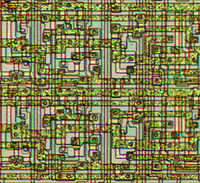
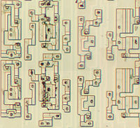
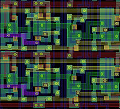
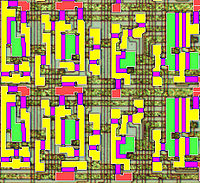
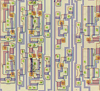
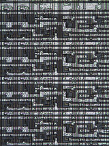
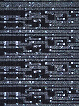
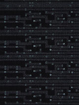
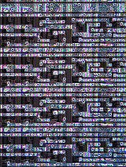
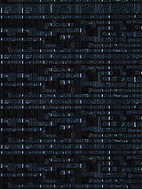

**Recovered visual6502.org wiki - beta release**

# 6502 Stack Register High Bits - VisualChips

## 6502 Stack Register High Bits

#### From VisualChips

A series of aligned photographs of the chip surface, chip substrate, and polygon model.

|  [(Link to larger image)](index.php-title-File-Stack_reg_high2_top.jpg.md) |  [(Link to larger image)](index.php-title-File-Stack_reg_high2_sub.jpg.md) |  [(Link to larger image)](index.php-title-File-Stack_reg_high2_vec.jpg.md) |  [(Link to larger image)](index.php-title-File-Stack_reg_high2_subTied.jpg.md) |  [(Link to larger image)](index.php-title-File-Stack_reg_high2_SPVTB.jpg.md) |
|:---:|:---:|:---:|:---:|:---:|

## 6507D register section

A series of aligned photographs: brightfield, brightfield with crossed polarizers, darkfield

|  [(Link to larger image)](index.php-title-File-6507_20x_top-000000r.jpg.md) |  [(Link to larger image)](index.php-title-File-6507_20x_top-000003r.jpg.md) |  [(Link to larger image)](index.php-title-File-6507_20x_top-000004r.jpg.md) |  [(Link to larger image)](index.php-title-File-6507_20x_top-000007r.jpg.md) |  [(Link to larger image)](index.php-title-File-6507_20x_top-000008r.jpg.md) |
|:---:|:---:|:---:|:---:|:---:|

Retrieved from "[http://visual6502.org/wiki/index.php?title=6502\_Stack\_Register\_High\_Bits](index.php-title-6502_Stack_Register_High_Bits.md)"

