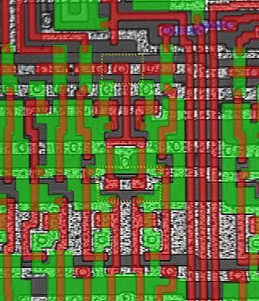

**Recovered visual6502.org wiki - beta release**

# 6502 datapath control timing fix - VisualChips

## 6502 datapath control timing fix

#### From VisualChips

This odd structure appears several times in the 6502 datapath.

A couple of transistors are connected to one clock (the on-chip phi2), but the shape of the poly shows evidence that they used to be connected to another (an inverted on-chip phi1). [See the missing contacts here](http://visual6502.org/JSSim/expert.html?nosim=t&find=cclk&panx=120.8&pany=307.6&zoom=12.4&label=missing,-100,1911,5256,2083,5163) in the JavaScript simulator.  Although contacts are not shown, you can tell that the contacts are missing from the south ends of the highlighted 'tuning fork' shape because the poly is highlighted but the horizontal metal which it crosses is not.

In the picture below, there are yellow rectangles to show the North and South ends of the poly where the shape shows possible contact cut positions. At the North end a contact cut is visible, but not at the South ends.

[(Link to larger image)](index.php-title-File-6502_photo_wrong-clock-annot.jpg.md)

That is, the gates were originally laid out so they could be clocked by not-phi1 but in fact are clocked by phi2.  They control the X and the Y driving onto SB (special bus).  There's another pair like them further along, which control the driving of the A onto the SB and the IDB.  Seems like a fix for a timing marginality?

### resources

- back to parent page [6502Observations](index.php-title-6502Observations.md)

Retrieved from "[http://visual6502.org/wiki/index.php?title=6502\_datapath\_control\_timing\_fix](index.php-title-6502_datapath_control_timing_fix.md)"

