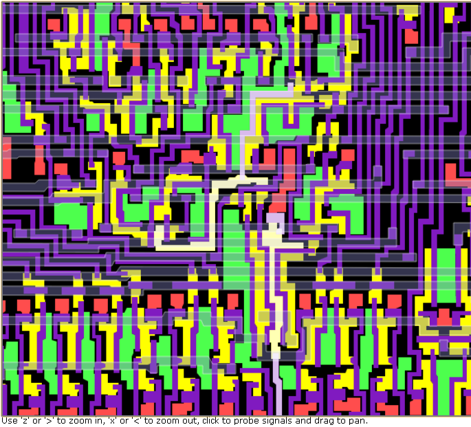

**INCOMPLETE DRAFT OF RECOVERED WIKI PAGE**

# 6502 increment PC control - VisualChips

## 6502 increment PC control

#### From VisualChips

The 6502 Program Counter has a dedicated incrementer which has to be able to increment across 16 bits in a single cycle.

It (almost) always increments during an instruction fetch cycle, to fetch a possible operand, but in general the decision whether or not to increment is a complex one.  The exception to incrementing during fetch is [illustrated here](http://visual6502.org/JSSim/expert.html?graphics=f&loglevel=2&steps=30&logmore=nmi,379,sync&nmi0=20) - in the cycle when an interrupt is recognised, the instruction fetch occurs but the instruction is ignored and the PC increment is suppressed in order that the PC value can be stacked.

As it happens, some of the logic implementing that decision is absent from Balazs' schematic, probably because of a bad patch in the die photograph.  It also happens to use some unusual NMOS logic techniques.

Here's the layout, as rendered by [visual6502's JSSim](http://visual6502.org/JSSim/expert.html?nosim=t&find=short-circuit-branch-add,379&panx=381.0&pany=284.0&zoom=8.0):

[(Link to larger image)](index.php-title-File-6502-ipc-layout.png)

The highlighted signal bottom centre is the negative-sense signal "dpc36\_#IPC", and the highlighted signal near the middle is "short-circuit-branch-add"

Here's a diagram of the final few logic stages, which react to page-crossing branches, taken branches, single-byte instructions, interrupt handing (D1x1) and stalled cycles (use of RDY):

[(Link to larger image)](index.php-title-File-6502-ipc-logic.png)

Note that the exclusive OR is implemented as a modified multiplexor which includes the subsequent AND function. The modification ensures that the AND's pulldown doesn't affect the signal notALUcout (node 206) which is used elsewhere, by pulling it down through the multiplexor's pass transistors.

Here's a transistor level view covering most of the same circuit:

[(Link to larger image)](index.php-title-File-6502-ipc-circuit.png)

Retrieved from "[http://visual6502.org/wiki/index.php?title=6502\_increment\_PC\_control](index.php-title-6502_increment_PC_control)"

