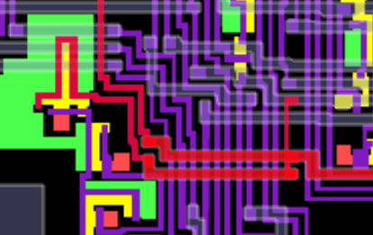
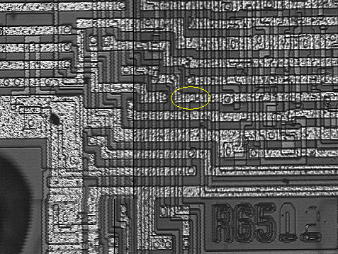
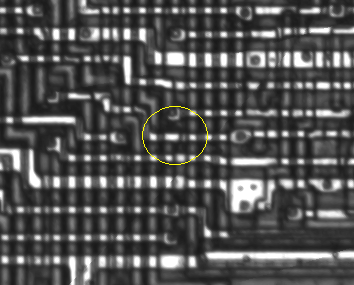

**Recovered visual6502.org wiki - beta release**

# 6502 traces of 6501 - VisualChips

## 6502 traces of 6501

#### From VisualChips

(Back to [6502 Observations](index.php-title-6502Observations.md))

The 6501 was the original product from MOS Technology (who, as a team, had recently left Motorola where they worked on the 6800.) It was pin-compatible but not code-compatible, and was withdrawn in a deal which left MOS free to sell the 6502 (even though it has many resemblances to the 6800)

There are several places on the NMOS 6502 where the layout shows the history: it is a modified 6501 and not an independent design.

**Contents**

- [Pinout differences](#pinout-differences)
- [Sync and BA](#sync-and-ba)
- [Pad assignment changes](#pad-assignment-changes)
- [Data Bus Enable](#data-bus-enable)
- [Resources](#resources)

### Pinout differences

As a quick piece of background: the 6501 was pinout compatible with 6800 - it could use the same socket. But the pins were not identical - 6501 and 6502 cannot tristate the address pins so 6501 was not compatible with a 6800 socket in a system using DMA.

- Pin 2: Halt on 6800, RDY on 6501 and 6502.  Compatible if not used.
- Pin 5: VMA (output) on 6800, tied high internally on 6501 (all addresses valid)
- Pin 39: TSC on 6800, no connect on 6501 and 6502. Needed for DMA.

Between the 6501 and 6502 there were pinout changes and bondout changes - some of the chip's pads were bonded to different pins of the package. Of course there were also chip layout changes - but we suspect there were not many. On the 6502, we have:

- Pin 3 is phi1 (output) instead of phi1 (input).
- Pin 7 is sync instead of BA output.
- Pin 36 is no connect instead of DBE input.
- Pin 38 is SO instead of no connect
- Pin 39 is phi2 (output) instead of no connect.

However, there were pad changes - pads on the chip are bonded to posts on the inside of the package and so connect to pins on the outside of the package.  Pad assignments can change without pinout assignments if the changes are not too great, and the bond wire rules allow it.

### Sync and BA

On the [left hand edge](http://visual6502.org/JSSim/expert.html?nosim=t&find=sync,862&panx=84.5&pany=212.8&zoom=10.4) of 6502, the Sync pad (pin 7) is driven by the on-chip signal 862. This signal is routed in parallel with itself a short distance, and has a poly structure which connects the two parts and has an unused landing pad where it crosses the on-chip [pipeline stall signal notRdy0](http://visual6502.org/JSSim/expert.html?nosim=t&find=198&panx=374.5&pany=205.0&zoom=10.0).  With one via removed and another added, pin 7 would act as BA (Bus Available) in a 6800-style system.

The JSSim view of this area:

[(Link to larger image)](index.php-title-File-Rdy-sync-no-via-6502d-jssim.png.md)

This area on the Rockwell R6502:

[(Link to larger image)](index.php-title-File-Rdy-sync-no-via-R6502-balazs.png.md)

This area on the 2A03:

[(Link to larger image)](index.php-title-File-Rdy-sync-no-via-2A03.png.md)

### Pad assignment changes

At top left of the 6502 die, you'll see two pads, the lower of which has [odd metal routing](http://visual6502.org/JSSim/expert.html?nosim=t&find=rw&panx=527.4&pany=44.0&zoom=7.2) next to it.

This is because these two pads are DB0 and RnW, bonded to pins 33 and 34 on 6502. On the 6501, these pads would have been routed - using the odd extra metal - to DB1 and DB0 and bonded to pins 32 and 33.

(We don't know what on 6501 occupied the space where 6502 has [pad DB1](http://visual6502.org/JSSim/expert.html?nosim=t&find=db1&panx=542.9&pany=373.3&zoom=7.0))

The RnW function would use the next pad around (anticlockwise), so the DBE input would use the next one around. That pushes the clk0 input over to the SO pad - and 6501 doesn't have an SO input, so that's everything.  The [drive transistors for RnW](http://visual6502.org/JSSim/expert.html?nosim=t&find=rw&panx=506.0&pany=60.0&zoom=5.0) are already better placed for this original arrangement, and there's [room for the metal connection](http://visual6502.org/JSSim/expert.html?nosim=t&find=358,so&panx=397.2&pany=51.8&zoom=5.8) of the clk0 input.

### Data Bus Enable

The 6502 doesn't have the DBE input found as pin 36 on 6501/6800. But the signal exists on the chip - it's tied to cclk, which is the chip-internal version of phi2. (This is why the 6502 tristates the data bus for approximately the first half of each clock cycle)

[Here's the location of the via](http://visual6502.org/JSSim/expert.html?nosim=t&find=cclk&panx=499&pany=47&zoom=16) which ties the two signals together.

[Here's a picture showing the two signals running in parallel](http://visual6502.org/JSSim/expert.html?nosim=t&find=cclk&panx=508.1&pany=168.7&zoom=10.4), even though they are on 6502 the same signal. See how they even interleave. This would represent a waste of space and effort if it the 6502 was an original design, but it's a minimal change to the 6501.

Here's a location where the Rockwell version of the chip has an extra short, compared to the MOS 6502D (and also showing that Nintendo's 2A03 has the MOS version of the layout)

[(Link to larger image)](index.php-title-File-Compare-r6502-balazs-2a03-dbe-short.png.md)

### Resources

- [KIM-1 Hardware Manual](http://users.telenet.be/kim1-6502/6502/hwman.html#121) showing pinouts of 6800 and 6501 (on erik.vdbroeck's site)
- [Byte article](http://www.swtpc.com/mholley/BYTE/Nov1975/Son_Of_Motorola.pdf) November 1975 anticipating the $20 pinout-compatible 6501 (article written in August - 6501 expected in September.) (on Michael Holley's site)
- [MOS Technology history](http://www.commodore.ca/history/company/mos/mos_technology.htm) mentioning $200k settlement with Motorola
- [MOS Technology](http://en.wikipedia.org/wiki/MOS_Technology) article on wikipedia

Retrieved from "[http://visual6502.org/wiki/index.php?title=6502\_traces\_of\_6501](index.php-title-6502_traces_of_6501.md)"

