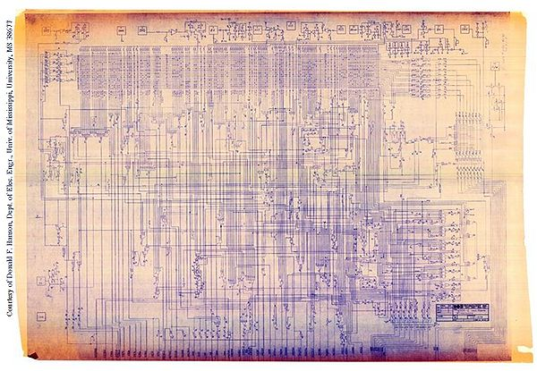
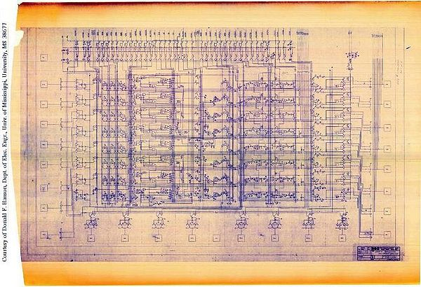
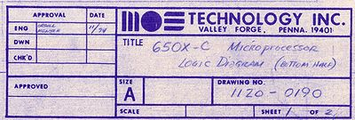
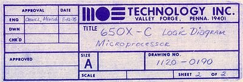
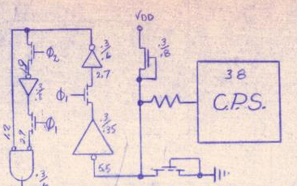
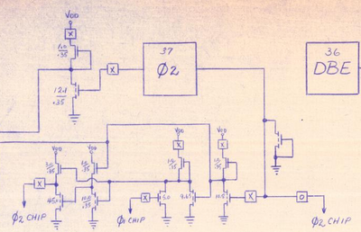
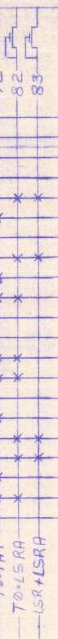

**INCOMPLETE DRAFT OF RECOVERED WIKI PAGE**

# 650X Schematic Notes - VisualChips

	

	
	

## 650X Schematic Notes

	

		

#### From VisualChips

		

		

		

Notes on the original 650X schematics from MOS Technology.

### Contents

- [1 Origin](#origin)
- [2 Overview](#overview)
- [3 Pin Names](#pin-names)
- [4 Chip Versions: 6501, 6502 and 6504](#chip-versions:-6501.2c-6502-and-6504)
- [5 Chip Revision C, ROR Bug, Other Errors](#chip-revision-c.2c-ror-bug.2c-other-errors)
- [6 Schematic Errors](#schematic-errors)
- [7 Logic gates and Transistors](#logic-gates-and-transistors)
- [8 Acknowledgements](#acknowledgements)
- [9 References](#references)

####  
 Origin 

In 1995 Donald F. Hanson, Ph.D., published a paper based in part on the 6502 blueprints.  His original work was to reverse engineer a detailed 
[block diagram](index.php?title=Hanson%!s(MISSING)_Block_Diagram) of the processor.  At the time he received the blueprints from MOS Technology in 1979, he had agreed to keep them confidential, except for educational use.  Earlier this year (2011), visual6502.org contacted Dr. Hanson.  After some negotiations, he agreed to provide scans of the original blueprints, for educational use only.  The blueprints he received were labeled Rev. C and contained a preliminary design.  Since the complete and error-free design (which we refer to as Rev D) is already known through the work of visual6502.org, Dr. Hanson felt that he could provide the Rev. C blueprints to visual6502.org for their historical value, provided that they be used for educational use.  

On this page we present some reduced-size images of those scans, and some findings from the information on them.

  

Sheet 2 Decode and Control (bears the date 8-12-75)

  

Sheet 1 "bottom half" Registers and Busses (bears the date 11/74)

 

####  
 Overview 

The two blueprints, or schematics, are approximately 62 x 44 inches and 63 x 44 inches. The one labelled as 'Sheet 1' and 'bottom half' contains the register file, its drivers, and most of the data and address pads. It is dated '11/74' and bears the names Orgill and Mensch. The one labelled as 'Sheet 2' contains everything else (decode ROM, IR, control logic, timing logic, all the other pads) and is dated 8-12-75, again with the names of Orgill and Mensch.

The labels contain the description '650X-C Logic Diagram'

The broad organisation of features and placement of pads resembles that of the 6502 Rev D chip.  These are therefore blueprints as much as they are schematics. The dates place them after the debut of the 6501 and 6502. However, details such as the ordering of the PLA lines differ markedly from the Rev D chip, indicating that these schematics derive from orginals which predate the final layout.  (The PLA lines are labelled according to their physical ordering on the Rev D.)

The chip design is mostly represented as logic gates, as transistors, and in the case of the decode ROM as Xs on a grid to mark pulldown transistors.  In many cases the physical size of the transistors are given, both for discretely drawn transistors and for logic gates. (In NMOS, electrical drive strength and therefore speed, and also load, are a direct function of size.)

The presumed die size including scribe lane is marked at bottom of sheet 1: 168 mil wide. There's no indication of the scribe lane or die height on sheet 2. (Wikipedia 
[reports](http://en.wikipedia.org/wiki/Motorola_6800#Design_team_break-up) die height as 153 mil)

  

ID from sheet 1 "bottom half" (bears the date 11/74)

 

  

ID from sheet 2 (bears the date 8-12-75)

####  
 Pin Names 

Some of the pad names are different from the modern 6502 pin names:

-  pin 5 is labelled VMA (for 6800 compatibility), but is No Connect on 6502

-  pin 7 is labelled T1, but is now known as Sync.

-  pin 36 is labelled DBE (for 6800 compatibility), but is now No Connect

-  pin 38 is labelled C.P.S. but is now known as SO for Set Overflow.  There's a 
[story](http://www.6502.org/tutorials/vflag.html) about the naming of this pin.

####  
 Chip Versions: 6501, 6502 and 6504 

As mentioned, the labels indicate that these schematics cover 650X - more than one variant product.  Along the top edge of the upper sheet there are several boxes marked with X or O which we believe allow for a 6501 or 6502 variant using only minor changes to the contact mask.

For example here are some options relating to the on-chip clocks, which differ depending on the use of the clock pins:

The T1 or SYNC pin is believed to require a slight change too between 6501 and 6502, which is possible in metal, but does not appear on the schematics.

The 6504 is a 28-pin version which requires the inputs NMI, RDY and SO to be tied-off. There is no hint of this in the schematic although a metal-only change is probably possible. Tie off by bond wire might also be possible.

####  
 Chip Revision C, ROR Bug, Other Errors 

The Revision C of the 6502 has the famous ROR bug. We can see the cause in the PLA: lines 82 and 83, right in the middle, decode T0:0100101x and 010xxx1x, where they should decode T0:01x0101x and 01xxxx1x.  That is, one extra pull-down on each line. Because of this, SRS is not set for ROR instructions, which causes these instructions to set SUMS and therefore shift left, and not to use the carry bit. See 
[Michael Steil's investigation](http://www.pagetable.com/?p=406) into this.

These two lines can be seen 
[here](http://visual6502.org/JSSim/expert.html?nosim=t&find=op-shift-right,op-T0-shift-right-a&panx=316.2&pany=103.9&zoom=5.0) in the visual6502 simulation and to the right in the schematic. Note that the PLA lines appear left to right in numeric order on the chip but were drawn in a different order.  (This must demonstrate that the form of the schematic predates the final layout.)

Also mention the other discrepancies in the PLA

Any other Rev C versus Rev D observations

####  
 Schematic Errors 

TBD

####  
 Logic gates and Transistors 

Mention and illustrate the presence of gates and transistors, the transistor sizes and die sizes in mils (thousandths of inch) and the presence of internal signal names - use the cross-coupled D1x1 latch to illustrate.  Compare with Balazs' schematic.

####  
 Acknowledgements 

Thanks to the following for their observations and assistance

-  Edgar F

-  Segher Boessenkool

-  Michael Steil

-  Donald F Hanson, for making the scans of the 6502 available to us

-  Department of Electrical Engineering, University of Mississippi, University, MS, for supporting Prof. Hanson’s work on the 6502 including the drafting of the 
[block diagram](index.php?title=Hanson%!s(MISSING)_Block_Diagram).

####  
 References 

-  Donald F. Hanson, [
["A VHDL Conversion Tool for Logic Equations with Embedded D Latches,"](http://www.witwright.com/DonPub/DSH_6502_ComputerArch.pdf)], Technical Committee on Computer Architecture Newsletter, pp. 49-56, Spring 1995, IEEE Computer Society.

