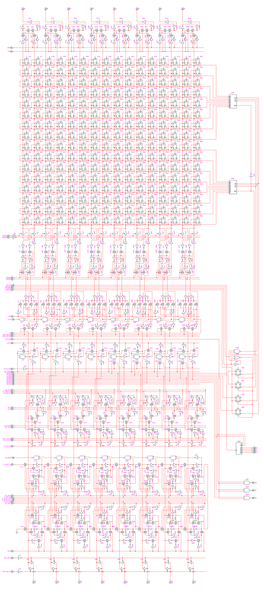

**INCOMPLETE DRAFT OF RECOVERED WIKI PAGE**

# File:1802 dpth-small.png - VisualChips

## File:1802 dpth-small.png

#### From VisualChips

Note: this is an image wrapper file. In the recovered wiki,
secondary content like talk pages and file histories was
not preserved. As a result, this file contains only a link
to an image, which may be a larger version of the image shown
in the page that linked here.

[(Link to larger image)](images/c/c0/1802_dpth-small.png)
No higher resolution available.
[1802\_dpth-small.png](images/c/c0/1802_dpth-small.png)‎ (264 × 600 pixels, file size: 173 KB, MIME type: image/png)

1802 datapath thumbnail

### File history

Click on a date/time to view the file as it appeared at that time.

| | Date/Time | Thumbnail | Dimensions | User | Comment |
|:---:|:---:|:---:|:---:|:---:|:---:|
| current | [08:55, 4 March 2013](images/c/c0/1802_dpth-small.png) | | 264×600 (173 KB) | [EdS](index.php-title-User-EdS.md)([Talk](index.php-title-User_talk-EdS.md) | [contribs](./index.php%3Ftitle=Special:Contributions/EdS.md)) | (1802 datapath thumbnail) |

- [Edit this file using an external application](index.php-title-File-1802_dpth-small.png.md)(See the [setup instructions](http://www.mediawiki.org/wiki/Manual:External_editors) for more information)

### File links

The following page links to this file:

- [RCA 1802E](index.php-title-RCA_1802E.md)

Retrieved from "[http://visual6502.org/wiki/index.php?title=File:1802\_dpth-small.png](index.php-title-File-1802_dpth-small.png.md)"

