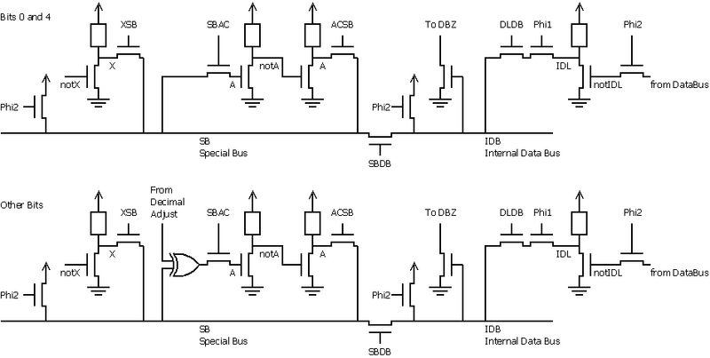
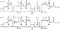

**INCOMPLETE DRAFT OF RECOVERED WIKI PAGE**

# File:6502-XAA-Idb-sb.png - VisualChips

	

	
	

## File:6502-XAA-Idb-sb.png

	

		

#### From VisualChips

		

		

		

- [File](#file)
- [File history](#filehistory)
- [File links](#filelinks)

Abbreviated diagram of internal databus and specical databus for XAA illustration.

