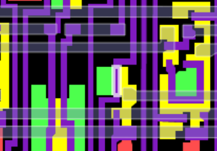

**Recovered visual6502.org wiki - beta release**

# File:6502-decimal-DAA-removed-visual6502.png - VisualChips

## File:6502-decimal-DAA-removed-visual6502.png

#### From VisualChips

Note: this is an image wrapper file. In the recovered wiki,
secondary content like talk pages and file histories was
not preserved. As a result, this file contains only a link
to an image, which may be a larger version of the image shown
in the page that linked here.

[(Link to larger image)](images/7/78/6502-decimal-DAA-removed-visual6502.png)
No higher resolution available.
[6502-decimal-DAA-removed-visual6502.png](images/7/78/6502-decimal-DAA-removed-visual6502.png)‎ (371 × 259 pixels, file size: 21 KB, MIME type: image/png)

Visual6502 screenshot showing t2556, one of the five transistors which is missing (shorted) in the NES 2A03

### File history

Click on a date/time to view the file as it appeared at that time.

| | Date/Time | Thumbnail | Dimensions | User | Comment |
|:---:|:---:|:---:|:---:|:---:|:---:|
| current | [17:37, 9 September 2012](images/7/78/6502-decimal-DAA-removed-visual6502.png) |  [(Link to larger image)](images/7/78/6502-decimal-DAA-removed-visual6502.png) | 371×259 (21 KB) | [EdS](index.php-title-User-EdS.md)([Talk](index.php-title-User_talk-EdS.md) | [contribs](./index.php%3Ftitle=Special:Contributions/EdS.md)) | (Improved framing and reduced fuzz (using canvas=4000) ) |
| | [11:36, 9 September 2012](images/archive/7/78/20120909173741~6502-decimal-DAA-removed-visual6502.png) |  [(Link to larger image)](images/archive/7/78/20120909173741~6502-decimal-DAA-removed-visual6502.png) | 430×351 (68 KB) | [EdS](index.php-title-User-EdS.md)([Talk](index.php-title-User_talk-EdS.md) | [contribs](./index.php%3Ftitle=Special:Contributions/EdS.md)) | (Visual6502 screenshot showing t2556, one of the five transistors which is missing (shorted) in the NES 2A03) |

- [Edit this file using an external application](index.php-title-File-6502-decimal-DAA-removed-visual6502.png.md)(See the [setup instructions](http://www.mediawiki.org/wiki/Manual:External_editors) for more information)

### File links

The following page links to this file:

- [6502DecimalMode](index.php-title-6502DecimalMode.md)

Retrieved from "[http://visual6502.org/wiki/index.php?title=File:6502-decimal-DAA-removed-visual6502.png](index.php-title-File-6502-decimal-DAA-removed-visual6502.png.md)"

