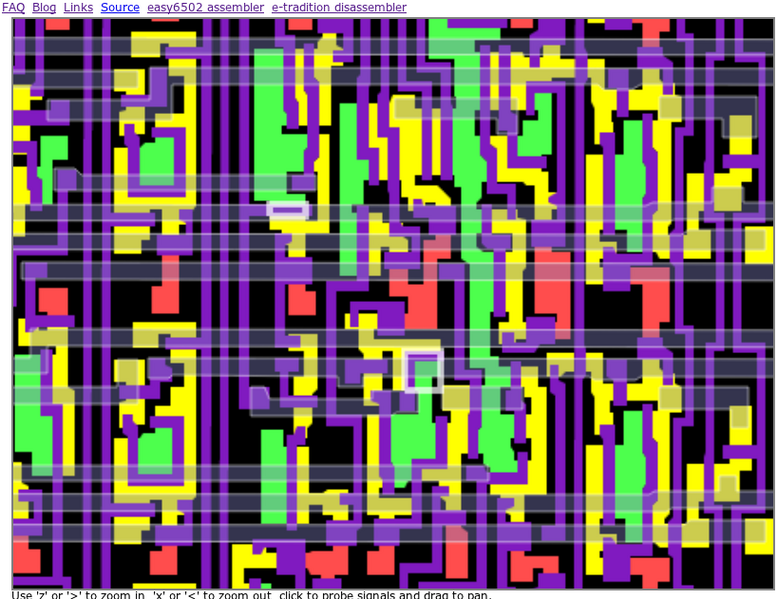
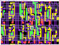

**INCOMPLETE DRAFT OF RECOVERED WIKI PAGE**

# File:6502-decimal-subtract-visual6502.png - VisualChips

	

	
	

## File:6502-decimal-subtract-visual6502.png

	

		

#### From VisualChips

		

		

		

- [File](#file)
- [File history](#filehistory)
- [File links](#filelinks)

Screenshot from visual6502 showing transistors t3212 and t1329, which were removed (shorted) in the NES 2A03 chip.

