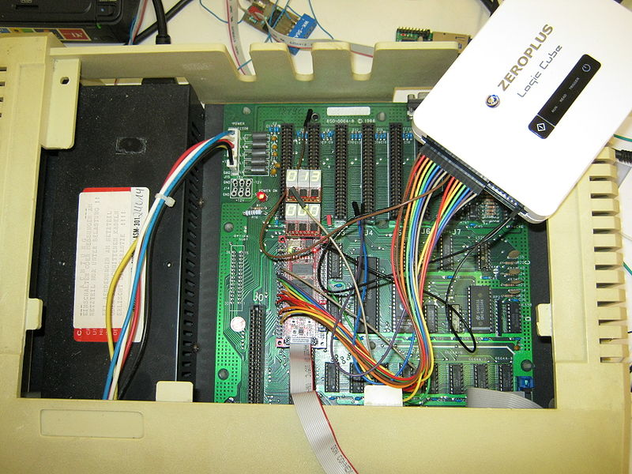
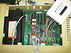

**INCOMPLETE DRAFT OF RECOVERED WIKI PAGE**

# File:6502-fpga-apple2-img 0040.jpg - VisualChips

	

	
	

## File:6502-fpga-apple2-img 0040.jpg

	

		

#### From VisualChips

		

		

		

- [File](#file)
- [File history](#filehistory)
- [File links](#filelinks)
- [Metadata](#metadata)

6502 netlist simulated in FPGA module in apple ][e clone (credit: Ingo Korb)

