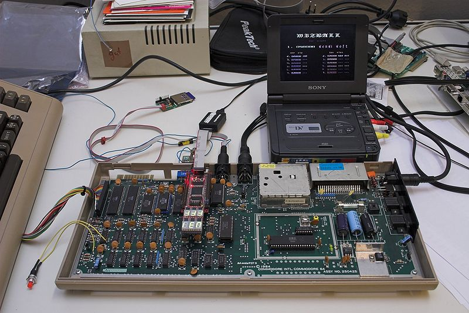

**INCOMPLETE DRAFT OF RECOVERED WIKI PAGE**

# File:6502-fpga-c64-overview-IMG 1080.jpg - VisualChips

## File:6502-fpga-c64-overview-IMG 1080.jpg

#### From VisualChips

Note: this is an image wrapper file. In the recovered wiki,
secondary content like talk pages and file histories was
not preserved. As a result, this file contains only a link
to an image, which may be a larger version of the image shown
in the page that linked here.

[(Link to larger image)](images/3/37/6502-fpga-c64-overview-IMG_1080.jpg)
Size of this preview: 800 × 533 pixels
[Full resolution](images/3/37/6502-fpga-c64-overview-IMG_1080.jpg)‎ (1,500 × 1,000 pixels, file size: 271 KB, MIME type: image/jpeg)

6502 netlist simulated in FPGA module in vintage 8-bit computer at approx 1MHz (credit: Ingo Korb)

### File history

Click on a date/time to view the file as it appeared at that time.

| | Date/Time | Thumbnail | Dimensions | User | Comment |
|:---:|:---:|:---:|:---:|:---:|:---:|
| current | [21:23, 17 May 2011](images/3/37/6502-fpga-c64-overview-IMG_1080.jpg) |  [(Link to larger image)](images/3/37/6502-fpga-c64-overview-IMG_1080.jpg) | 1,500×1,000 (271 KB) | [EdS](index.php-title-User-EdS.md)([Talk](index.php-title-User_talk-EdS.md) | [contribs](./index.php%3Ftitle=Special:Contributions/EdS.md)) | (6502 netlist simulated in FPGA module in vintage 8-bit computer at approx 1MHz (credit: Ingo Korb)) |

- [Edit this file using an external application](index.php-title-File-6502-fpga-c64-overview-IMG_1080.jpg.md)(See the [setup instructions](http://www.mediawiki.org/wiki/Manual:External_editors) for more information)

### File links

The following page links to this file:

- [6502 - simulating in real time on an FPGA](index.php-title-6502_-_simulating_in_real_time_on_an_FPGA.md)

Retrieved from "[http://visual6502.org/wiki/index.php?title=File:6502-fpga-c64-overview-IMG\_1080.jpg](index.php-title-File-6502-fpga-c64-overview-IMG_1080.jpg.md)"

