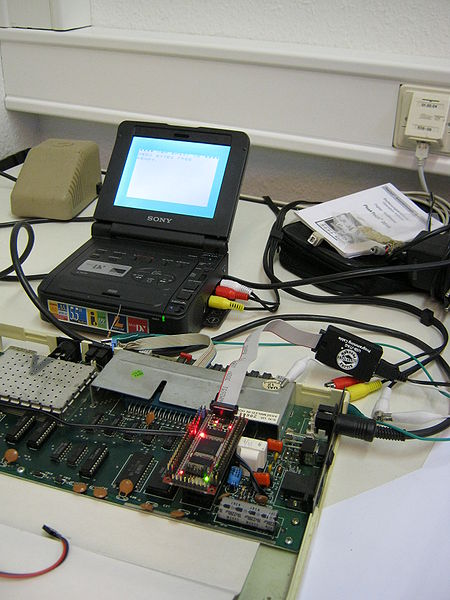

**INCOMPLETE DRAFT OF RECOVERED WIKI PAGE**

# File:6502-fpga-vic20-img 0039.jpg - VisualChips

## File:6502-fpga-vic20-img 0039.jpg

#### From VisualChips

Note: this is an image wrapper file. In the recovered wiki,
secondary content like talk pages and file histories was
not preserved. As a result, this file contains only a link
to an image, which may be a larger version of the image shown
in the page that linked here.

[(Link to larger image)](images/7/70/6502-fpga-vic20-img_0039.jpg)
Size of this preview: 450 × 600 pixels
[Full resolution](images/7/70/6502-fpga-vic20-img_0039.jpg)‎ (2,736 × 3,648 pixels, file size: 2.22 MB, MIME type: image/jpeg)

6502 netlist simulated in FPGA module in VIC20 (credit: Ingo Korb)

### File history

Click on a date/time to view the file as it appeared at that time.

| | Date/Time | Thumbnail | Dimensions | User | Comment |
|:---:|:---:|:---:|:---:|:---:|:---:|
| current | [19:48, 12 May 2011](images/7/70/6502-fpga-vic20-img_0039.jpg) |  [(Link to larger image)](images/7/70/6502-fpga-vic20-img_0039.jpg) | 2,736×3,648 (2.22 MB) | [EdS](index.php-title-User-EdS.md)([Talk](index.php-title-User_talk-EdS.md) | [contribs](./index.php%3Ftitle=Special:Contributions/EdS.md)) | (6502 netlist simulated in FPGA module in VIC20) |

- [Edit this file using an external application](index.php-title-File-6502-fpga-vic20-img_0039.jpg.md)(See the [setup instructions](http://www.mediawiki.org/wiki/Manual:External_editors) for more information)

### File links

The following page links to this file:

- [6502 - simulating in real time on an FPGA](index.php-title-6502_-_simulating_in_real_time_on_an_FPGA.md)

### Metadata
This file contains additional information, probably added from the digital camera or scanner used to create or digitize it.
If the file has been modified from its original state, some details may not fully reflect the modified file.

| Camera manufacturer | Canon |
|:---:|:---:|
Camera model | Canon PowerShot A495 |
Exposure time | 1/60 sec (0.016666666666667) |
F Number | f/3 |
ISO speed rating | 400 |
Date and time of data generation | 10:54, 3 May 2011 |
Lens focal length | 6.6 mm |
Orientation | Normal |
Horizontal resolution | 180 dpi |
Vertical resolution | 180 dpi |
File change date and time | 10:54, 3 May 2011 |
Y and C positioning | 2 |
Exif version | 2.21 |
Date and time of digitizing | 10:54, 3 May 2011 |
Image compression mode | 3 |
Shutter speed | 5.90625 |
Aperture | 3.15625 |
Exposure bias | 0 |
Maximum land aperture | 3.15625 |
Metering mode | Pattern |
Flash | Flash did not fire, auto mode |
Color space | sRGB |
Focal plane X resolution | 15,136.929460581 |
Focal plane Y resolution | 15,116.022099448 |
Focal plane resolution unit | inches |
Sensing method | One-chip color area sensor |
Custom image processing | Normal process |
Exposure mode | Auto exposure |
White balance | Auto white balance |
Digital zoom ratio | 1 |
Scene capture type | Standard |

Retrieved from "[http://visual6502.org/wiki/index.php?title=File:6502-fpga-vic20-img\_0039.jpg](index.php-title-File-6502-fpga-vic20-img_0039.jpg.md)"

