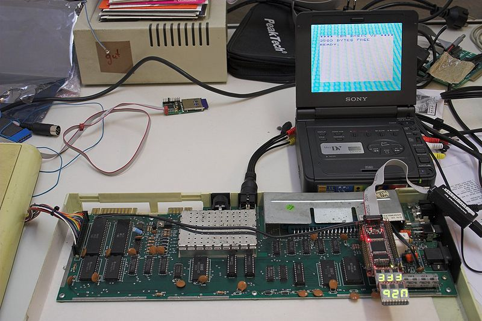
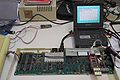

**INCOMPLETE DRAFT OF RECOVERED WIKI PAGE**

# File:6502-fpga-vic20-overview-IMG 1081.jpg - VisualChips

	

	
	

## File:6502-fpga-vic20-overview-IMG 1081.jpg

	

		

#### From VisualChips

		

		

		

- [File](#file)
- [File history](#filehistory)
- [File links](#filelinks)

6502 netlist simulated in FPGA module in vintage 8-bit computer at approx 1MHz (credit: Ingo Korb)

