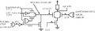

**INCOMPLETE DRAFT OF RECOVERED WIKI PAGE**

# File:6502-ipc-circuit.png - VisualChips

	

	
	

## File:6502-ipc-circuit.png

	

		

#### From VisualChips

		

		

		

- [File](#file)
- [File history](#filehistory)
- [File links](#filelinks)

6502 circuit detail for incrementing PC, mostly transistor-level

