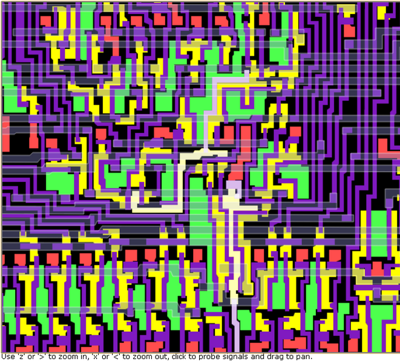

**INCOMPLETE DRAFT OF RECOVERED WIKI PAGE**

# File:6502-ipc-layout.png - VisualChips

## File:6502-ipc-layout.png

#### From VisualChips

Note: this is an image wrapper file. In the recovered wiki,
secondary content like talk pages and file histories was
not preserved. As a result, this file contains only a link
to an image, which may be a larger version of the image shown
in the page that linked here.

[(Link to larger image)](images/b/b2/6502-ipc-layout.png)
Size of this preview: 661 × 599 pixels
[Full resolution](images/b/b2/6502-ipc-layout.png)‎ (685 × 621 pixels, file size: 124 KB, MIME type: image/png)

Layout image from JSSim of the final logic stages leading to the 6502's incrementer enable input.

### File history

Click on a date/time to view the file as it appeared at that time.

| | Date/Time | Thumbnail | Dimensions | User | Comment |
|:---:|:---:|:---:|:---:|:---:|:---:|
| current | [16:44, 19 February 2011](images/b/b2/6502-ipc-layout.png) |  [(Link to larger image)](images/b/b2/6502-ipc-layout.png) | 685×621 (124 KB) | [EdS](index.php-title-User-EdS.md)([Talk](index.php-title-User_talk-EdS.md) | [contribs](./index.php%3Ftitle=Special:Contributions/EdS.md)) | (Layout image from JSSim of the final logic stages leading to the 6502's incrementer enable input.) |

- [Edit this file using an external application](index.php-title-File-6502-ipc-layout.png.md)(See the [setup instructions](http://www.mediawiki.org/wiki/Manual:External_editors) for more information)

### File links

The following page links to this file:

- [6502 increment PC control](index.php-title-6502_increment_PC_control.md)

Retrieved from "[http://visual6502.org/wiki/index.php?title=File:6502-ipc-layout.png](index.php-title-File-6502-ipc-layout.png.md)"

