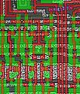

**INCOMPLETE DRAFT OF RECOVERED WIKI PAGE**

# File:6502 photo wrong-clock-annot.jpg - VisualChips

## File:6502 photo wrong-clock-annot.jpg

#### From VisualChips

Note: this is an image wrapper file. In the recovered wiki,
secondary content like talk pages and file histories was
not preserved. As a result, this file contains only a link
to an image, which may be a larger version of the image shown
in the page that linked here.

[(Link to larger image)](images/9/97/6502_photo_wrong-clock-annot.jpg)
No higher resolution available.
[6502\_photo\_wrong-clock-annot.jpg](images/9/97/6502_photo_wrong-clock-annot.jpg)‎ (323 × 375 pixels, file size: 44 KB, MIME type: image/jpeg)

Close up of R6502 layout showing datapath control lines clocked oddly with missing vias. Annotated to show present and missing contact cuts.

### File history

Click on a date/time to view the file as it appeared at that time.

| | Date/Time | Thumbnail | Dimensions | User | Comment |
|:---:|:---:|:---:|:---:|:---:|:---:|
| current | [09:42, 29 December 2011](images/9/97/6502_photo_wrong-clock-annot.jpg) |  [(Link to larger image)](images/9/97/6502_photo_wrong-clock-annot.jpg) | 323×375 (44 KB) | [EdS](index.php-title-User-EdS.md)([Talk](index.php-title-User_talk-EdS.md) | [contribs](./index.php%3Ftitle=Special:Contributions/EdS.md)) | (Close up of R6502 layout showing datapath control lines clocked oddly with missing vias. Annotated to show present and missing contact cuts. ) |

- [Edit this file using an external application](index.php-title-File-6502_photo_wrong-clock-annot.jpg.md)(See the [setup instructions](http://www.mediawiki.org/wiki/Manual:External_editors) for more information)

### File links

The following page links to this file:

- [6502 datapath control timing fix](index.php-title-6502_datapath_control_timing_fix.md)

Retrieved from "[http://visual6502.org/wiki/index.php?title=File:6502\_photo\_wrong-clock-annot.jpg](index.php-title-File-6502_photo_wrong-clock-annot.jpg.md)"

