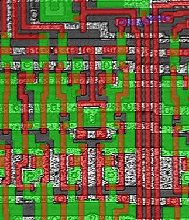
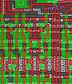

**INCOMPLETE DRAFT OF RECOVERED WIKI PAGE**

# File:6502 photo wrong-clock.jpg - VisualChips

	

	
	

## File:6502 photo wrong-clock.jpg

	

		

#### From VisualChips

		

		

		

- [File](#file)
- [File history](#filehistory)
- [File links](#filelinks)

Close up of R6502 layout showing datapath control lines clocked oddly with missing vias

