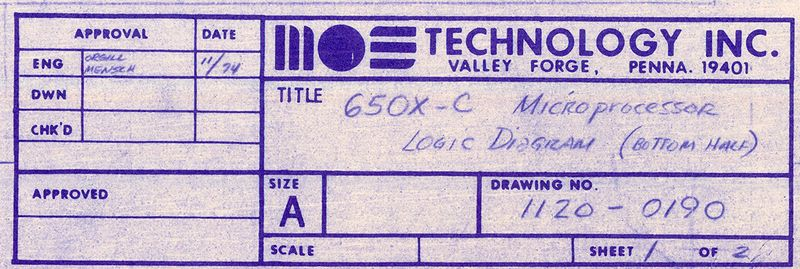
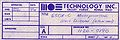

**INCOMPLETE DRAFT OF RECOVERED WIKI PAGE**

# File:6502 schematic sheet1-11-74.id.jpeg - VisualChips

	

	
	

## File:6502 schematic sheet1-11-74.id.jpeg

	

		

#### From VisualChips

		

		

		

- [File](#file)
- [File history](#filehistory)
- [File links](#filelinks)

Credit: MOS Technology

Identification area from MOS Technology "650X-C Microprocessor Logic Diagram (Bottom Half)" sheet 1

"Engineering Approval by ORGILL and MENSCH" dated 11/74

Scan: Courtesy of Donald F. Hanson, Dept. of Elec. Engr., Univ. of Mississippi, University, MS 38677

