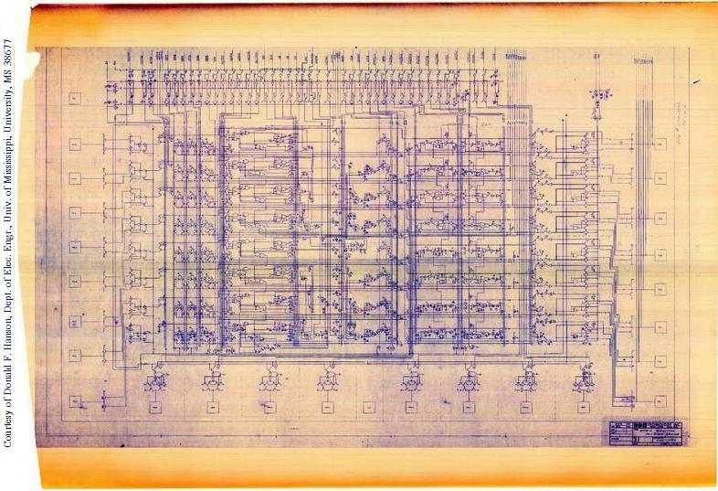
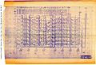

**Recovered visual6502.org wiki - beta release**

# File:6502 schematic sheet1-11-74.jpeg - VisualChips

## File:6502 schematic sheet1-11-74.jpeg

#### From VisualChips

Note: this is an image wrapper file. In the recovered wiki,
secondary content like talk pages and file histories was
not preserved. As a result, this file contains only a link
to an image, which may be a larger version of the image shown
in the page that linked here.

[(Link to larger image)](images/5/59/6502_schematic_sheet1-11-74.jpeg)
No higher resolution available.
[6502\_schematic\_sheet1-11-74.jpeg](images/5/59/6502_schematic_sheet1-11-74.jpeg)‎ (786 × 537 pixels, file size: 97 KB, MIME type: image/jpeg)

Credit: MOS Technology

Sheet 1 "650X-C Microprocessor Logic Diagram (Bottom Half)"

"Engineering Approval by ORGILL and MENSCH" dated 11/74

Scan: Courtesy of Donald F. Hanson, Dept. of Elec. Engr., Univ. of Mississippi, University, MS 38677

### File history

Click on a date/time to view the file as it appeared at that time.

| | Date/Time | Thumbnail | Dimensions | User | Comment |
|:---:|:---:|:---:|:---:|:---:|:---:|
| current | [11:45, 7 November 2011](images/5/59/6502_schematic_sheet1-11-74.jpeg) |  [(Link to larger image)](images/5/59/6502_schematic_sheet1-11-74.jpeg) | 786×537 (97 KB) | [EdS](index.php-title-User-EdS.md)([Talk](index.php-title-User_talk-EdS.md) | [contribs](./index.php%3Ftitle=Special:Contributions/EdS.md)) | (Credit: MOS Technology  Sheet 1 "650X-C Microprocessor Logic Diagram (Bottom Half)"  "Engineering Approval by ORGILL and MENSCH" dated 11/74  Scan: Courtesy of Donald F. Hanson, Dept. of Elec. Engr., Univ. of Mississippi, University, MS 38677) |

- [Edit this file using an external application](index.php-title-File-6502_schematic_sheet1-11-74.jpeg.md)(See the [setup instructions](http://www.mediawiki.org/wiki/Manual:External_editors) for more information)

### File links

The following page links to this file:

- [650X Schematic Notes](index.php-title-650X_Schematic_Notes.md)

Retrieved from "[http://visual6502.org/wiki/index.php?title=File:6502\_schematic\_sheet1-11-74.jpeg](index.php-title-File-6502_schematic_sheet1-11-74.jpeg.md)"

