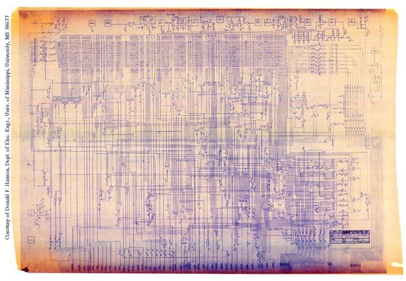
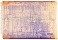

**Recovered visual6502.org wiki - beta release**

# File:6502 schematic sheet2-8-12-75.jpeg - VisualChips

## File:6502 schematic sheet2-8-12-75.jpeg

#### From VisualChips

Note: this is an image wrapper file. In the recovered wiki,
secondary content like talk pages and file histories was
not preserved. As a result, this file contains only a link
to an image, which may be a larger version of the image shown
in the page that linked here.

[(Link to larger image)](images/6/6a/6502_schematic_sheet2-8-12-75.jpeg)
Size of this preview: 800 × 554 pixels
[Full resolution](images/6/6a/6502_schematic_sheet2-8-12-75.jpeg)‎ (809 × 560 pixels, file size: 375 KB, MIME type: image/jpeg)

Credit: MOS Technology

Sheet 2 "650X-C Logic Diagram Microprocessor"

"Engineering Approval by ORGILL, MENSCH" dated 8-12-75

Scan: Courtesy of Donald F. Hanson, Dept. of Elec. Engr., Univ. of Mississippi, University, MS 38677

### File history

Click on a date/time to view the file as it appeared at that time.

| | Date/Time | Thumbnail | Dimensions | User | Comment |
|:---:|:---:|:---:|:---:|:---:|:---:|
| current | [11:46, 7 November 2011](images/6/6a/6502_schematic_sheet2-8-12-75.jpeg) |  [(Link to larger image)](images/6/6a/6502_schematic_sheet2-8-12-75.jpeg) | 809×560 (375 KB) | [EdS](index.php-title-User-EdS.md)([Talk](index.php-title-User_talk-EdS.md) | [contribs](./index.php%3Ftitle=Special:Contributions/EdS.md)) | (Credit: MOS Technology  Sheet 2 "650X-C Logic Diagram Microprocessor"  "Engineering Approval by ORGILL, MENSCH" dated 8-12-75  Scan: Courtesy of Donald F. Hanson, Dept. of Elec. Engr., Univ. of Mississippi, University, MS 38677) |

- [Edit this file using an external application](index.php-title-File-6502_schematic_sheet2-8-12-75.jpeg.md)(See the [setup instructions](http://www.mediawiki.org/wiki/Manual:External_editors) for more information)

### File links

The following page links to this file:

- [650X Schematic Notes](index.php-title-650X_Schematic_Notes.md)

Retrieved from "[http://visual6502.org/wiki/index.php?title=File:6502\_schematic\_sheet2-8-12-75.jpeg](index.php-title-File-6502_schematic_sheet2-8-12-75.jpeg.md)"

