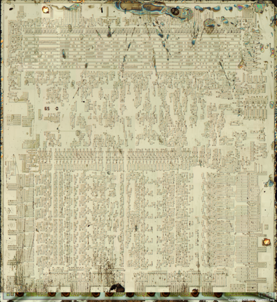
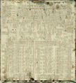

**Recovered visual6502.org wiki - beta release**

# File:6502 sub.png - VisualChips

## File:6502 sub.png

#### From VisualChips

Note: this is an image wrapper file. In the recovered wiki,
secondary content like talk pages and file histories was
not preserved. As a result, this file contains only a link
to an image, which may be a larger version of the image shown
in the page that linked here.

[(Link to larger image)](images/c/c1/6502_sub.png)
Size of this preview: 550 × 600 pixels
[Full resolution](images/c/c1/6502_sub.png)‎ (1,500 × 1,635 pixels, file size: 4.88 MB, MIME type: image/png)

### File history

Click on a date/time to view the file as it appeared at that time.

| | Date/Time | Thumbnail | Dimensions | User | Comment |
|:---:|:---:|:---:|:---:|:---:|:---:|
| current | [09:14, 27 September 2010](images/c/c1/6502_sub.png) |  [(Link to larger image)](images/c/c1/6502_sub.png) | 1,500×1,635 (4.88 MB) | [V6wiki](index.php-title-User-V6wiki.md)([Talk](index.php-title-User_talk-V6wiki.md) | [contribs](./index.php%3Ftitle=Special:Contributions/V6wiki.md)) | |

- [Edit this file using an external application](index.php-title-File-6502_sub.png.md)(See the [setup instructions](http://www.mediawiki.org/wiki/Manual:External_editors) for more information)

### File links

The following page links to this file:

- [Photos of MOS 6502D](index.php-title-Photos_of_MOS_6502D.md)

Retrieved from "[http://visual6502.org/wiki/index.php?title=File:6502\_sub.png](index.php-title-File-6502_sub.png.md)"

