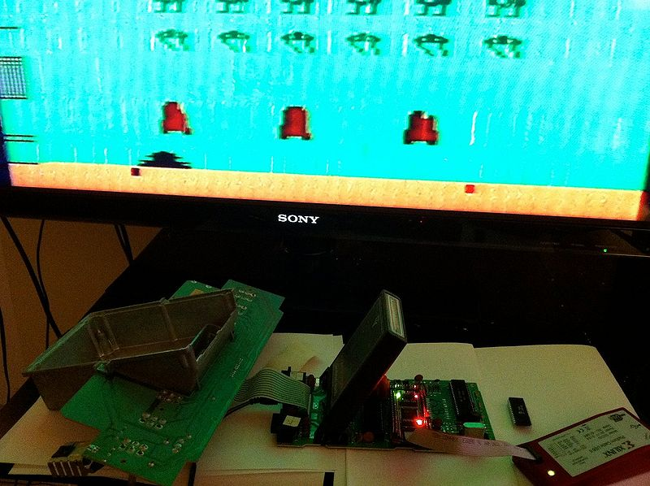
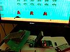

**INCOMPLETE DRAFT OF RECOVERED WIKI PAGE**

# File:6507-demo0.jpg - VisualChips

	

	
	

## File:6507-demo0.jpg

	

		

#### From VisualChips

		

		

		

- [File](#file)
- [File history](#filehistory)
- [File links](#filelinks)
- [Metadata](#metadata)

6502 netlist resimulated in FPGA acting as a 6507 in Atari system

