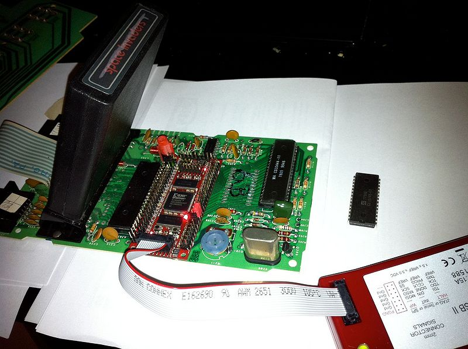
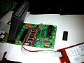

**INCOMPLETE DRAFT OF RECOVERED WIKI PAGE**

# File:6507-demo1.jpg - VisualChips

## File:6507-demo1.jpg

#### From VisualChips

Note: this is an image wrapper file. In the recovered wiki,
secondary content like talk pages and file histories was
not preserved. As a result, this file contains only a link
to an image, which may be a larger version of the image shown
in the page that linked here.

[(Link to larger image)](images/c/c9/6507-demo1.jpg)
Size of this preview: 800 × 598 pixels
[Full resolution](images/c/c9/6507-demo1.jpg)‎ (1,300 × 971 pixels, file size: 279 KB, MIME type: image/jpeg)

6502 netlist resimulated in FPGA acting as a 6507 in Atari system

### File history

Click on a date/time to view the file as it appeared at that time.

| | Date/Time | Thumbnail | Dimensions | User | Comment |
|:---:|:---:|:---:|:---:|:---:|:---:|
| current | [18:22, 12 May 2011](images/c/c9/6507-demo1.jpg) |  [(Link to larger image)](images/c/c9/6507-demo1.jpg) | 1,300×971 (279 KB) | [EdS](index.php-title-User-EdS.md)([Talk](index.php-title-User_talk-EdS.md) | [contribs](./index.php%3Ftitle=Special:Contributions/EdS.md)) | (6502 netlist resimulated in FPGA acting as a 6507 in Atari system) |

- [Edit this file using an external application](index.php-title-File-6507-demo1.jpg.md)(See the [setup instructions](http://www.mediawiki.org/wiki/Manual:External_editors) for more information)

### File links

The following page links to this file:

- [6502 - simulating in real time on an FPGA](index.php-title-6502_-_simulating_in_real_time_on_an_FPGA.md)

### Metadata
This file contains additional information, probably added from the digital camera or scanner used to create or digitize it.
If the file has been modified from its original state, some details may not fully reflect the modified file.

| Camera manufacturer | Apple |
|:---:|:---:|
Camera model | iPhone 4 |
Exposure time | 1/28 sec (0.035714285714286) |
F Number | f/2.8 |
ISO speed rating | 80 |
Date and time of data generation | 20:16, 19 January 2011 |
Lens focal length | 3.85 mm |
Orientation | Normal |
Horizontal resolution | 72 dpi |
Vertical resolution | 72 dpi |
Software used | GIMP 2.6.11 |
File change date and time | 20:36, 19 January 2011 |
Y and C positioning | 1 |
Exposure Program | Normal program |
Exif version | 2.21 |
Date and time of digitizing | 20:16, 19 January 2011 |
Shutter speed | 4.7983673469388 |
Aperture | 2.970853573907 |
Metering mode | Average |
Flash | Flash fired, compulsory flash firing |
Color space | sRGB |
Sensing method | One-chip color area sensor |
Exposure mode | Auto exposure |
White balance | Auto white balance |
Scene capture type | Standard |
Sharpness | Hard |
North or south latitude | North latitude |
East or west longitude | West longitude |
Reference for direction of image | True direction |
Direction of image | 124.6402266289 |

Retrieved from "[http://visual6502.org/wiki/index.php?title=File:6507-demo1.jpg](index.php-title-File-6507-demo1.jpg.md)"

