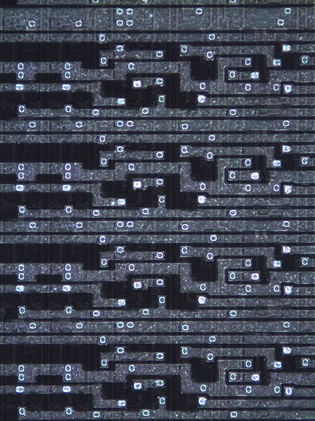
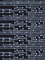

**INCOMPLETE DRAFT OF RECOVERED WIKI PAGE**

# File:6507 20x top-000003r.jpg - VisualChips

## File:6507 20x top-000003r.jpg

#### From VisualChips

Note: this is an image wrapper file. In the recovered wiki,
secondary content like talk pages and file histories was
not preserved. As a result, this file contains only a link
to an image, which may be a larger version of the image shown
in the page that linked here.

[(Link to larger image)](images/d/d3/6507_20x_top-000003r.jpg)
Size of this preview: 450 × 600 pixels
[Full resolution](images/d/d3/6507_20x_top-000003r.jpg)‎ (1,200 × 1,600 pixels, file size: 396 KB, MIME type: image/jpeg)

### File history

Click on a date/time to view the file as it appeared at that time.

| | Date/Time | Thumbnail | Dimensions | User | Comment |
|:---:|:---:|:---:|:---:|:---:|:---:|
| current | [06:14, 1 October 2010](images/d/d3/6507_20x_top-000003r.jpg) |  [(Link to larger image)](images/d/d3/6507_20x_top-000003r.jpg) | 1,200×1,600 (396 KB) | [V6wiki](index.php-title-User-V6wiki.md)([Talk](index.php-title-User_talk-V6wiki.md) | [contribs](./index.php%3Ftitle=Special:Contributions/V6wiki.md)) | |

- [Edit this file using an external application](index.php-title-File-6507_20x_top-000003r.jpg.md)(See the [setup instructions](http://www.mediawiki.org/wiki/Manual:External_editors) for more information)

### File links

The following page links to this file:

- [6502 Stack Register High Bits](index.php-title-6502_Stack_Register_High_Bits.md)

Retrieved from "[http://visual6502.org/wiki/index.php?title=File:6507\_20x\_top-000003r.jpg](index.php-title-File-6507_20x_top-000003r.jpg.md)"

