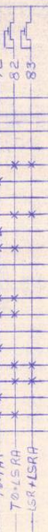

**Recovered visual6502.org wiki - beta release**

# File:650X-revC-ROR-pla.png - VisualChips

## File:650X-revC-ROR-pla.png

#### From VisualChips

Note: this is an image wrapper file. In the recovered wiki,
secondary content like talk pages and file histories was
not preserved. As a result, this file contains only a link
to an image, which may be a larger version of the image shown
in the page that linked here.

[(Link to larger image)](images/5/56/650X-revC-ROR-pla.png)
Size of this preview: 54 × 595 pixels
[Full resolution](images/5/56/650X-revC-ROR-pla.png)‎ (58 × 639 pixels, file size: 60 KB, MIME type: image/png)

detail from 650X Schematic showing erroneous lines in the decoder responsible for the ROR bug

### File history

Click on a date/time to view the file as it appeared at that time.

| | Date/Time | Thumbnail | Dimensions | User | Comment |
|:---:|:---:|:---:|:---:|:---:|:---:|
| current | [15:37, 9 April 2012](images/5/56/650X-revC-ROR-pla.png) |  [(Link to larger image)](images/5/56/650X-revC-ROR-pla.png) | 58×639 (60 KB) | [EdS](index.php-title-User-EdS.md)([Talk](index.php-title-User_talk-EdS.md) | [contribs](./index.php%3Ftitle=Special:Contributions/EdS.md)) | (detail from 650X Schematic showing erroneous lines in the decoder responsible for the ROR bug) |

- [Edit this file using an external application](index.php-title-File-650X-revC-ROR-pla.png.md)(See the [setup instructions](http://www.mediawiki.org/wiki/Manual:External_editors) for more information)

### File links

The following page links to this file:

- [650X Schematic Notes](index.php-title-650X_Schematic_Notes.md)

Retrieved from "[http://visual6502.org/wiki/index.php?title=File:650X-revC-ROR-pla.png](index.php-title-File-650X-revC-ROR-pla.png.md)"

