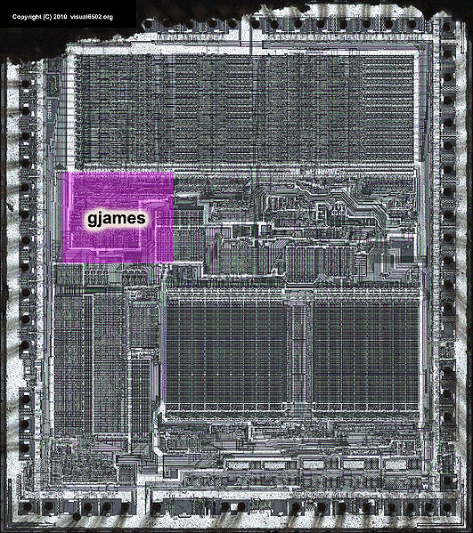
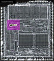

**Recovered visual6502.org wiki - beta release**

# File:68000 vec annot.jpg - VisualChips

## File:68000 vec annot.jpg

#### From VisualChips

Note: this is an image wrapper file. In the recovered wiki,
secondary content like talk pages and file histories was
not preserved. As a result, this file contains only a link
to an image, which may be a larger version of the image shown
in the page that linked here.

[(Link to larger image)](images/7/78/68000_vec_annot.jpg)
Size of this preview: 531 × 599 pixels
[Full resolution](images/7/78/68000_vec_annot.jpg)‎ (1,000 × 1,128 pixels, file size: 764 KB, MIME type: image/jpeg)

### File history

Click on a date/time to view the file as it appeared at that time.

| | Date/Time | Thumbnail | Dimensions | User | Comment |
|:---:|:---:|:---:|:---:|:---:|:---:|
| current | [08:40, 10 December 2010](images/7/78/68000_vec_annot.jpg) |  [(Link to larger image)](images/7/78/68000_vec_annot.jpg) | 1,000×1,128 (764 KB) | [Visual6502](index.php-title-User-Visual6502.md)([Talk](index.php-title-User_talk-Visual6502.md) | [contribs](./index.php%3Ftitle=Special:Contributions/Visual6502.md)) | |

- [Edit this file using an external application](index.php-title-File-68000_vec_annot.jpg.md)(See the [setup instructions](http://www.mediawiki.org/wiki/Manual:External_editors) for more information)

### File links

The following page links to this file:

- [Motorola 68000](index.php-title-Motorola_68000.md)

Retrieved from "[http://visual6502.org/wiki/index.php?title=File:68000\_vec\_annot.jpg](index.php-title-File-68000_vec_annot.jpg.md)"

