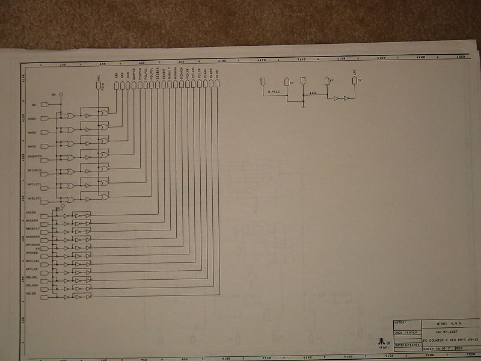
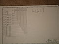

**Recovered visual6502.org wiki - beta release**

# File:Atari 6507 7B.jpg - VisualChips

## File:Atari 6507 7B.jpg

#### From VisualChips

Note: this is an image wrapper file. In the recovered wiki,
secondary content like talk pages and file histories was
not preserved. As a result, this file contains only a link
to an image, which may be a larger version of the image shown
in the page that linked here.

[(Link to larger image)](images/0/07/Atari_6507_7B.jpg)
Size of this preview: 800 × 600 pixels
[Full resolution](images/0/07/Atari_6507_7B.jpg)‎ (1,600 × 1,200 pixels, file size: 698 KB, MIME type: image/jpeg)

### File history

Click on a date/time to view the file as it appeared at that time.

| | Date/Time | Thumbnail | Dimensions | User | Comment |
|:---:|:---:|:---:|:---:|:---:|:---:|
| current | [21:36, 26 September 2010](images/0/07/Atari_6507_7B.jpg) |  [(Link to larger image)](images/0/07/Atari_6507_7B.jpg) | 1,600×1,200 (698 KB) | [Michael Steil](index.php-title-User-Michael_Steil.md)([Talk](index.php-title-User_talk-Michael_Steil.md) | [contribs](./index.php%3Ftitle=Special:Contributions/Michael_Steil.md)) | |

- [Edit this file using an external application](index.php-title-File-Atari_6507_7B.jpg.md)(See the [setup instructions](http://www.mediawiki.org/wiki/Manual:External_editors) for more information)

### File links

The following page links to this file:

- [Atari's 6507 Schematics](index.php-title-Atari~s_6507_Schematics.md)

### Metadata
This file contains additional information, probably added from the digital camera or scanner used to create or digitize it.
If the file has been modified from its original state, some details may not fully reflect the modified file.

| Camera manufacturer | Canon |
|:---:|:---:|
Camera model | Canon PowerShot S110 |
Exposure time | 1/60 sec (0.016666666666667) |
F Number | f/4 |
Date and time of data generation | 16:52, 13 January 2010 |
Lens focal length | 10.8125 mm |
Orientation | Normal |
Horizontal resolution | 180 dpi |
Vertical resolution | 180 dpi |
File change date and time | 16:52, 13 January 2010 |
Y and C positioning | 1 |
Exif version | 2.1 |
Date and time of digitizing | 16:52, 13 January 2010 |
Image compression mode | 5 |
Shutter speed | 5.90625 |
Aperture | 4 |
Exposure bias | 0 |
Maximum land aperture | 2.9708557128906 |
Subject distance | 0.754 meters |
Metering mode | Pattern |
Flash | Flash fired |
Color space | sRGB |
Focal plane X resolution | 7,766.9902912621 |
Focal plane Y resolution | 7,741.935483871 |
Focal plane resolution unit | inches |
Sensing method | One-chip color area sensor |

Retrieved from "[http://visual6502.org/wiki/index.php?title=File:Atari\_6507\_7B.jpg](index.php-title-File-Atari_6507_7B.jpg.md)"

