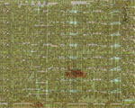
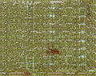

**INCOMPLETE DRAFT OF RECOVERED WIKI PAGE**

# File:Example.jpg - VisualChips

## File:Example.jpg

#### From VisualChips

Note: this is an image wrapper file. In the recovered wiki,
secondary content like talk pages and file histories was
not preserved. As a result, this file contains only a link
to an image, which may be a larger version of the image shown
in the page that linked here.

[(Link to larger image)](images/a/a9/Example.jpg)
No higher resolution available.
[Example.jpg](images/a/a9/Example.jpg)‎ (150 × 120 pixels, file size: 24 KB, MIME type: image/jpeg)

### File history

Click on a date/time to view the file as it appeared at that time.

| | Date/Time | Thumbnail | Dimensions | User | Comment |
|:---:|:---:|:---:|:---:|:---:|:---:|
| current | [08:10, 27 September 2010](images/a/a9/Example.jpg) |  [(Link to larger image)](images/a/a9/Example.jpg) | 150×120 (24 KB) | [V6wiki](index.php-title-User-V6wiki.md)([Talk](index.php-title-User_talk-V6wiki.md) | [contribs](./index.php%3Ftitle=Special:Contributions/V6wiki.md)) | |

- [Edit this file using an external application](index.php-title-File-Example.jpg.md)(See the [setup instructions](http://www.mediawiki.org/wiki/Manual:External_editors) for more information)

### File links

There are no pages that link to this file.

### Metadata
This file contains additional information, probably added from the digital camera or scanner used to create or digitize it.
If the file has been modified from its original state, some details may not fully reflect the modified file.

| Orientation | Normal |
|:---:|:---:|
Horizontal resolution | 72 dpi |
Vertical resolution | 72 dpi |
Software used | Adobe Photoshop 7.0 |
File change date and time | 13:38, 26 September 2010 |
Color space | 65535 |

Retrieved from "[http://visual6502.org/wiki/index.php?title=File:Example.jpg](index.php-title-File-Example.jpg.md)"

