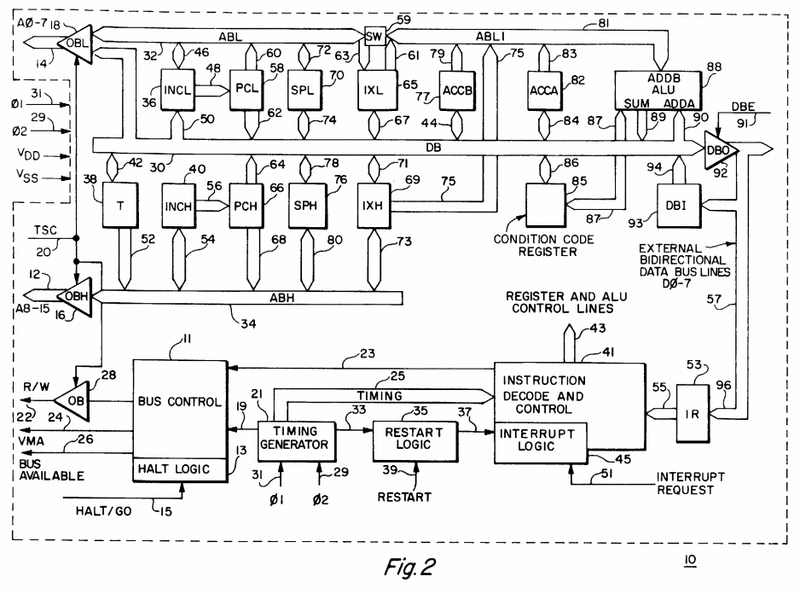
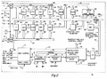

**INCOMPLETE DRAFT OF RECOVERED WIKI PAGE**

# File:M6800-arch.png - VisualChips

## File:M6800-arch.png

#### From VisualChips

Note: this is an image wrapper file. In the recovered wiki,
secondary content like talk pages and file histories was
not preserved. As a result, this file contains only a link
to an image, which may be a larger version of the image shown
in the page that linked here.

[(Link to larger image)](images/e/ea/M6800-arch.png)
Size of this preview: 800 × 594 pixels
[Full resolution](images/e/ea/M6800-arch.png)‎ (938 × 696 pixels, file size: 183 KB, MIME type: image/png)

Motorola 6800 block diagram (Fig 2 from US Patent 3987418, 1976, fair use.)

### File history

Click on a date/time to view the file as it appeared at that time.

| | Date/Time | Thumbnail | Dimensions | User | Comment |
|:---:|:---:|:---:|:---:|:---:|:---:|
| current | [10:32, 28 March 2011](images/e/ea/M6800-arch.png) |  [(Link to larger image)](images/e/ea/M6800-arch.png) | 938×696 (183 KB) | [EdS](index.php-title-User-EdS.md)([Talk](index.php-title-User_talk-EdS.md) | [contribs](./index.php%3Ftitle=Special:Contributions/EdS.md)) | (Motorola 6800 block diagram (Fig 2 from US Patent 3987418, 1976, fair use.)) |

- [Edit this file using an external application](index.php-title-File-M6800-arch.png.md)(See the [setup instructions](http://www.mediawiki.org/wiki/Manual:External_editors) for more information)

### File links

The following page links to this file:

- [Motorola 6800](index.php-title-Motorola_6800.md)

Retrieved from "[http://visual6502.org/wiki/index.php?title=File:M6800-arch.png](index.php-title-File-M6800-arch.png.md)"

