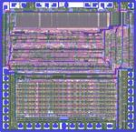
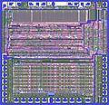

**INCOMPLETE DRAFT OF RECOVERED WIKI PAGE**

# File:Mc6800a-Layout-svg-150h.jpg - VisualChips

## File:Mc6800a-Layout-svg-150h.jpg

#### From VisualChips

Note: this is an image wrapper file. In the recovered wiki,
secondary content like talk pages and file histories was
not preserved. As a result, this file contains only a link
to an image, which may be a larger version of the image shown
in the page that linked here.

[(Link to larger image)](images/7/77/Mc6800a-Layout-svg-150h.jpg)
No higher resolution available.
[Mc6800a-Layout-svg-150h.jpg](images/7/77/Mc6800a-Layout-svg-150h.jpg)‎ (150 × 145 pixels, file size: 7 KB, MIME type: image/jpeg)

Thumbnail of mc6800 layout (SVG format: polygons manually re-captured from microphotography)

### File history

Click on a date/time to view the file as it appeared at that time.

| | Date/Time | Thumbnail | Dimensions | User | Comment |
|:---:|:---:|:---:|:---:|:---:|:---:|
| current | [17:51, 5 April 2011](images/7/77/Mc6800a-Layout-svg-150h.jpg) |  [(Link to larger image)](images/7/77/Mc6800a-Layout-svg-150h.jpg) | 150×145 (7 KB) | [EdS](index.php-title-User-EdS.md)([Talk](index.php-title-User_talk-EdS.md) | [contribs](./index.php%3Ftitle=Special:Contributions/EdS.md)) | (Thumbnail of mc6800 layout (SVG format: polygons manually re-captured from microphotography)) |

- [Edit this file using an external application](index.php-title-File-Mc6800a-Layout-svg-150h.jpg.md)(See the [setup instructions](http://www.mediawiki.org/wiki/Manual:External_editors) for more information)

### File links

The following page links to this file:

- [Motorola 6800](index.php-title-Motorola_6800.md)

Retrieved from "[http://visual6502.org/wiki/index.php?title=File:Mc6800a-Layout-svg-150h.jpg](index.php-title-File-Mc6800a-Layout-svg-150h.jpg.md)"

