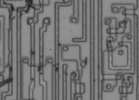

**INCOMPLETE DRAFT OF RECOVERED WIKI PAGE**

# File:NES-2A03-decimal-DAA-removed.png - VisualChips

	

	
	

## File:NES-2A03-decimal-DAA-removed.png

	

		

#### From VisualChips

		

		

		

- [File](#file)
- [File history](#filehistory)
- [File links](#filelinks)

Transistor t2556 is missing (shorted) - one of five so treated to remove decimal mode from the NES 2A03

