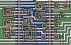

**INCOMPLETE DRAFT OF RECOVERED WIKI PAGE**

# File:Rca1802-detail-annotated.jpg - VisualChips

	

	
	

## File:Rca1802-detail-annotated.jpg

	

		

#### From VisualChips

		

		

		

- [File](#file)
- [File history](#filehistory)
- [File links](#filelinks)

Annotated detail showing a few CMOS logic gates on the RCA 1802

