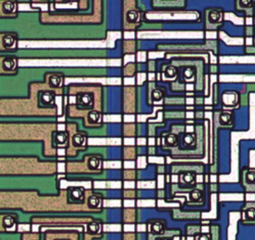

**INCOMPLETE DRAFT OF RECOVERED WIKI PAGE**

# File:Rca1802-detail-nor4.png - VisualChips

## File:Rca1802-detail-nor4.png

#### From VisualChips

Note: this is an image wrapper file. In the recovered wiki,
secondary content like talk pages and file histories was
not preserved. As a result, this file contains only a link
to an image, which may be a larger version of the image shown
in the page that linked here.

[(Link to larger image)](images/b/be/Rca1802-detail-nor4.png)
No higher resolution available.
[Rca1802-detail-nor4.png](images/b/be/Rca1802-detail-nor4.png)‎ (430 × 406 pixels, file size: 473 KB, MIME type: image/png)

detail of a NOR4 (in non-concentric style) on the RCA1802E

### File history

Click on a date/time to view the file as it appeared at that time.

| | Date/Time | Thumbnail | Dimensions | User | Comment |
|:---:|:---:|:---:|:---:|:---:|:---:|
| current | [09:11, 13 March 2011](images/b/be/Rca1802-detail-nor4.png) |  [(Link to larger image)](images/b/be/Rca1802-detail-nor4.png) | 430×406 (473 KB) | [EdS](index.php-title-User-EdS.md)([Talk](index.php-title-User_talk-EdS.md) | [contribs](./index.php%3Ftitle=Special:Contributions/EdS.md)) | (detail of a NOR4 (in non-concentric style) on the RCA1802E) |

- [Edit this file using an external application](index.php-title-File-Rca1802-detail-nor4.png.md)(See the [setup instructions](http://www.mediawiki.org/wiki/Manual:External_editors) for more information)

### File links

There are no pages that link to this file.

Retrieved from "[http://visual6502.org/wiki/index.php?title=File:Rca1802-detail-nor4.png](index.php-title-File-Rca1802-detail-nor4.png.md)"

