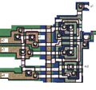

**INCOMPLETE DRAFT OF RECOVERED WIKI PAGE**

# File:Rca1802-detail2-nor4.png - VisualChips

	

	
	

## File:Rca1802-detail2-nor4.png

	

		

#### From VisualChips

		

		

		

- [File](#file)
- [File history](#filehistory)
- [File links](#filelinks)

Annotated detail of a NOR4 (in non-concentric style) on the RCA1802E

