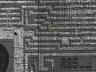

**INCOMPLETE DRAFT OF RECOVERED WIKI PAGE**

# File:Rdy-sync-no-via-R6502-balazs.png - VisualChips

	

	
	

## File:Rdy-sync-no-via-R6502-balazs.png

	

		

#### From VisualChips

		

		

		

- [File](#file)
- [File history](#filehistory)
- [File links](#filelinks)

closeup of Balazs' R6502 photo showing RDY and SYNC cross with a poly landing pad but are not via-connected.

