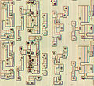

**Recovered visual6502.org wiki - beta release**

# File:Stack reg high2 sub.jpg - VisualChips

## File:Stack reg high2 sub.jpg

#### From VisualChips

Note: this is an image wrapper file. In the recovered wiki,
secondary content like talk pages and file histories was
not preserved. As a result, this file contains only a link
to an image, which may be a larger version of the image shown
in the page that linked here.

[(Link to larger image)](images/1/15/Stack_reg_high2_sub.jpg)
Size of this preview: 655 × 600 pixels
[Full resolution](images/1/15/Stack_reg_high2_sub.jpg)‎ (922 × 844 pixels, file size: 209 KB, MIME type: image/jpeg)

### File history

Click on a date/time to view the file as it appeared at that time.

| | Date/Time | Thumbnail | Dimensions | User | Comment |
|:---:|:---:|:---:|:---:|:---:|:---:|
| current | [18:28, 29 September 2010](images/1/15/Stack_reg_high2_sub.jpg) |  [(Link to larger image)](images/1/15/Stack_reg_high2_sub.jpg) | 922×844 (209 KB) | [Visual6502](index.php-title-User-Visual6502.md)([Talk](index.php-title-User_talk-Visual6502.md) | [contribs](./index.php%3Ftitle=Special:Contributions/Visual6502.md)) | |

- [Edit this file using an external application](index.php-title-File-Stack_reg_high2_sub.jpg.md)(See the [setup instructions](http://www.mediawiki.org/wiki/Manual:External_editors) for more information)

### File links

The following page links to this file:

- [6502 Stack Register High Bits](index.php-title-6502_Stack_Register_High_Bits.md)

Retrieved from "[http://visual6502.org/wiki/index.php?title=File:Stack\_reg\_high2\_sub.jpg](index.php-title-File-Stack_reg_high2_sub.jpg.md)"

