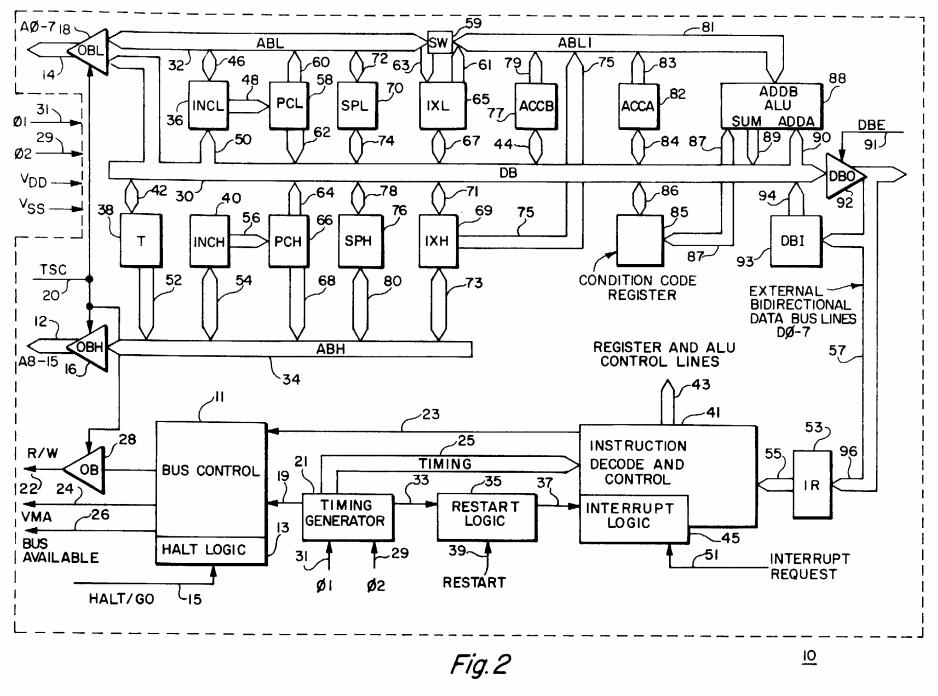

**INCOMPLETE DRAFT OF RECOVERED WIKI PAGE**

# Motorola 6800 - VisualChips

	

	
	

## Motorola 6800

	

		

#### From VisualChips

		

		

		

See 
[Wikipedia](http://en.wikipedia.org/wiki/Motorola_6800) for good technical and historical information and references on the Motorola 6800.

### Contents

- [1 Chip Photos](#chip-photos)
- [2 Chip Simulator](#chip-simulator)
- [3 Points of Interest](#points-of-interest)
- [4 Block Diagram](#block-diagram)
- [5 Resources](#resources)

####  
 Chip Photos 

We 
[depackaged, deprocessed and photographed](http://www.visual6502.org/images/pages/Motorola_6800_die_shots.html) a later depletion-load version of the chip, which shows signs in the layout of the previous enhancement-load version.  Ijor then captured polygons from the photos - here are JPEG images, which may be easier to explore than the svg format:

The recaptured polygon data closely resembles the original layout which defined the masks used to manufacture the chip, and is a great deal easier to study than the photographs.

####  
 Chip Simulator 

From the polygons we were able to construct a netlist, and Segher then labelled many of interior nodes, and so we present our JavaScript simulator: 
[(graphical mode)](http://visual6502.org/JSSim/expert-6800.html?nosim=t) 
[(non-graphical mode)](http://visual6502.org/JSSim/expert-6800.html?graphics=f&loglevel=4&steps=20). As with our 6502 simulator, you can explore the layout and the behaviour, find signals and transistors by name, and share short test programs by URL.

####  
 Points of Interest 

We've found these interesting features (more detail to be added):

-  register circuit using resistive feedback and enhancement-style pullups

-  data latch circuit using weak feedback transistor

-  clock pulse shaping

-  both 
[node 251](http://visual6502.org/JSSim/expert-6800.html?nosim=t&find=251) and 
[abh/ahd](http://visual6502.org/JSSim/expert-6800.html?nosim=t&find=abh/ahd) are inverted phi2 signals

-  
[node 95](http://visual6502.org/JSSim/expert-6800.html?nosim=t&find=95) is phi2 and not abh/ahd and therefore a phi2 with a delayed rising edge

  resistive bus pullup

  Manchester carry chain

  
[unexplained circuit](http://visual6502.org/JSSim/expert-6800.html?nosim=t&find=t5074&panx=214.1&pany=105.8&zoom=12.4) isolating IRQ and HALT near PHI1 pin

####  
 Block Diagram 

Here's the block diagram from the 
[1976 topology patent](http://www.google.com/patents?id=6OkAAAAAEBAJ&zoom=4&pg=PA3#v=onepage&q&f=false) (See also 
[this later patent.](http://www.freepatentsonline.com/4090236.pdf)):

####  
 Resources 

-  
[Wikipedia article](http://en.wikipedia.org/wiki/Motorola_6800)
-  
[Datasheet (pdf)](http://people.sinclair.edu/nickreeder/eet252/datasheets/MC6800.pdf) (Nick Reeder at Sinclair Community College)

-  
[Instruction set summary](ftp://ftp.comlab.ox.ac.uk/pub/Cards/txt/6800.txt) (comlab at Oxford University)

-  
[Programming Model](http://www.sbprojects.com/sbasm/6800.htm#model) (website for SB-assembler)

-  
[US Patent 4090236](http://www.freepatentsonline.com/4090236.pdf) for single power supply NMOS microprocessor (filed 1976, granted '78) contains block diagrams, state transition diagrams, instruction decode tables, circuit and logic diagrams

-  
[US Patent 3987418](http://www.google.com/patents/about?id=6OkAAAAAEBAJ) for MOS microprocessor topography (filed 1974, granted '76) contains floorplan, low resolution layout mask images, block diagram

