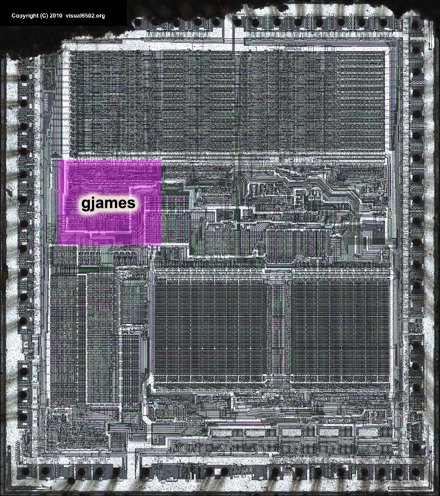

**INCOMPLETE DRAFT OF RECOVERED WIKI PAGE**

# Motorola 68000 - VisualChips

## Motorola 68000

#### From VisualChips

This is a scratch page for information and updates on a very early alpha tool for collaborative vector drawing.

Until a scratch layer with comments is available, update this image to indicate the region you're working on:

[(Link to larger image)](index.php-title-File-68000_vec_annot.jpg)

Retrieved from "[http://visual6502.org/wiki/index.php?title=Motorola\_68000](index.php-title-Motorola_68000)"

