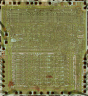
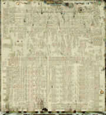

**INCOMPLETE DRAFT OF RECOVERED WIKI PAGE**

# Photos of MOS 6502D - VisualChips

	

	
	

## Photos of MOS 6502D

	

		

#### From VisualChips

		

		

		

In the summer of 2009, the Visual6502.org project shot and assembled high resolution photographs of a MOS 6502 revD.  The surface of the chip was photographed, then the metal and polysilicon layers were stripped off to reveal the conductive substrate diffusion areas.  This substrate was photographed, and the substrate image was aligned to the surface image.  These two aligned images were used to create the vector polygons that form the Visual6502 chip simulation.

  

  

See 
[our website](http://visual6502.org/images/6502/index.html) for more.

