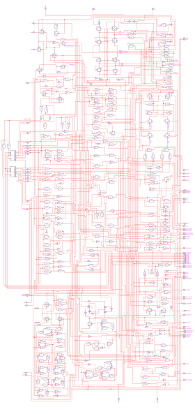
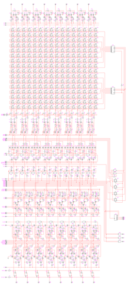
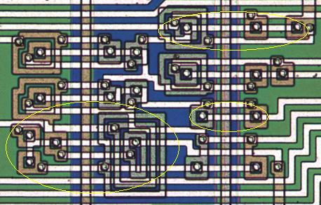
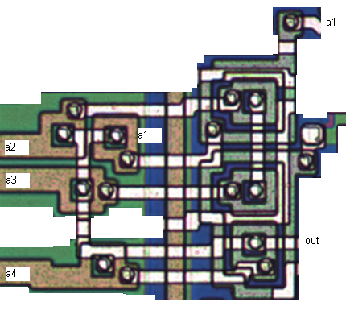

**INCOMPLETE DRAFT OF RECOVERED WIKI PAGE**

# RCA 1802E - VisualChips

## RCA 1802E

#### From VisualChips

The RCA 1802 was a pioneering CMOS microprocessor.

See our main site for [some more information and images.](http://www.visual6502.org/images/pages/RCA_1802_die_shots.html)

Not only was the C2L CMOS process simpler, denser and faster than previous ones, it lends itself to radiation-hard chips, which led to this CPU being found in various space probes.  (The bulk silicon process used for our RCA 1802 is not as radiation tolerant as the later silicon-on-sapphire processes, but it was better than other contemporary processes.)

As it happens, it's also a great process for us to photograph and analyse, because the N and P structures show as different colours, and the layout is very readable.  For the same reason, with this chip reverse-engineering the die photo may be feasible without needing to strip the metal.

**Contents**

- [Control Logic](#control-logic)
- [Datapath](#datapath)
- [1. /ARO, /ALO](#1-aro-alo)
- [2. REGWL, REGWR](#2-regwl-regwr)
- [3. /REGRL, /REGRR](#3-regrl-regrr)
- [4. /EF1234, SELREG0, SELREG2, and REGSEL](#4-ef1234-selreg0-selreg2-and-regsel)
- [5. DEC, COUT, CIN](#5-dec-cout-cin)
- [6. REG\_DB\_EN, REG\_OUT\_EN](#6-reg_db_en-reg_out_en)
- [7. NOUTEN](#7-nouten)
- [8. /LD\_IN, /N\_TO\_RAB, /IN\_RESET, INTDB0~INTDB7](#link-could-not-be-patched)
- [9. /SET\_P1X2, /P\_RAB\_OUT, /X\_RAB\_OUT, /LD\_X, /LD\_P, LD\_FR\_DB, LD\_FR\_N](#9-set_p1x2-p_rab_out-x_rab_out-ld_x-ld_p-ld_fr_db-ld_fr_n)
- [10. /LD\_T\_FR\_PX, LD\_T\_FR\_PX, /T\_OUT\_EN](#10-ld_t_fr_px-ld_t_fr_px-t_out_en)
- [11. /D\_ZERO, D\_SHIFT\_IN, /D\_SHIFT, D\_OUT\_EN, D\_SHIFT\_OUT](#11-d_zero-d_shift_in-d_shift-d_out_en-d_shift_out)
- [12. B\_SHIFT\_OUT, B\_OUT\_EN, /B\_SHIFT, /LD\_B](#12-b_shift_out-b_out_en-b_shift-ld_b)
- [13. EXT\_DB\_IN, EXT\_DB\_OUT](#13-ext_db_in-ext_db_out)
- [Simple logic gates](#simple-logic-gates)
- [NOR4 layout](#nor4-layout)
- [Resources](#resources)

#### Control Logic



[(Link to larger image)](images/6/64/Rca1802-control-reversed.gif)

This schematic was derived by tracing the excellent die photo, so the arrangement of the gates pretty much follows the layout on die. There are an extensive
use of transparent latches of various enable and output polarities, which are denoted with squares.

The design is much more asynchronous than the 6502 or any of the later CPUs; the clock input at the far left goes through the
wait/pause/reset logic, and basically only 2 blocks get clocked at the input rate, which is the signal coming out of U77: the sequencer, and the ALU.

The sequencer is a Johnson counter that uses latches, generating 8 phase-shifted signals I've named seq0 through seq7. It's located southeast of /tpa. Interestingly there's a patent (6020770) by Motorola several decades later on using transparent latches in a Johnson counter. Anyway, seq0-7 feed the logic to the right, which produces signals active for various periods of the sequence - I've denoted these CL0-F. As it's a latch-based design both rising and falling edges of the clock are used.

The ALU in the bottom left is serial and multiplexer-based. 3 latches above it pick off the lower 3 bits of the internal data bus to select the function. U123 is the main output (goes to D\_SHIFT\_IN of the datapath), and U63 is the carry out which goes to the carry flag latch U177.

North of the ALU, above the internal databus and below the clock/reset logic, is instruction decoding, fed from the 2-to-16 decoder to its left. Each line of 16 opcodes is decoded separately.

On the east, below the seq0-7 logic, is the main state machine with 4 latches for EXECUTE, INTERRUPT, FETCH, and DMA. Below that are latches for Q and the interrupt enable, as well as more datapath control logic. Finally, the top left corner contains the interrupt/DMA input circuitry.

[text contributed by AmyK]

See [#Resources](#resources) for more.

#### Datapath



[(Link to larger image)](images/6/62/1802_dpth.png)

Note that the register bits are just represented as transparent 
latches, in reality they are two inverters and NMOS transmission 
gates. But otherwise everything else should be a mostly accurate 
representation of the circuit.

##### 1. /ARO, /ALO

Located above the register file are a set of latches that drive the address pad 
outputs. Since the processor can output either the upper or lower 8 bits of any 
register, these latches have two inputs and two enable signals; ALO and ARO, 
when asserted, respectively allow the left or right 8 bits of the selected 
register to be output, and latch the value when deasserted. Taking the leftmost 
(A7) address latch as an example, we see the storage loop formed by U1, U22, 
U23, and U20, with the left and right bits entering via U3 and U28 respectively 
and their gates U2 and U24. When both control signals are deasserted, the loop 
is closed to latch the last input value, but either of them can be asserted to 
break the loop and allow either bit's value to enter.

(Note that in the control logic schematic these are labelled /AHO and /ALO; the 
inconsistency is because which half of the register file held which bits was 
not yet known before deciphering the control logic.)

##### 2. REGWL, REGWR

When asserted, these signals cause the respective bit line to be driven via the 
inverted data-in signal coming from the logic below, to effect register writes. 
This is shown in the schematic for the leftmost bit as the controlled buffers 
U4 and U62, and the data-in signal via U64. The storage element of the register 
file is the standard inverter loop with NMOS pass transistors, and writing is 
usually accomplished by forcing the bit to the right value, as the bit lines 
have a stronger drive than the storage inverters. The datapath analysis at[http://home.earthlink.net/~schultdw/1802/datapath/index.html](http://home.earthlink.net/~schultdw/1802/datapath/index.html) suggests that the 
large rectangular series PMOS transistors in the middle disconnect power to the 
PMOS inverters in the storage loop during a write, although this would mean the 
1802 is not truly static since stopping the clock when either of these control 
signals is high would result in data loss.

##### 3. /REGRL, /REGRR

These signals control the latch between the register output and the increment- 
decrement unit. With asserted, the respective 8-bit half of the register chosen 
are output into the incdec, and the output is latched once deasserted. Taking 
the leftmost element as an example again, the storage loop is formed from U9, 
U70, U10, and U73, with entrances via U7/U8 and U65/U67. Notice that the write 
data line goes up through the middle of this latch unit in the IC layout.

##### 4. /EF1234, SELREG0, SELREG2, and REGSEL

Not part of the datapath proper, but these signals run horizontally through it, 
to the circuitry to its right. /EF1234 is an input of the value on the selected 
/EF{1,2,3,4} input. SELREG0 resets all the register selection latches, causing 
register 0 to be selected, while SELREG2 has the same effect as well as setting 
bit 1 of the register selection bus, causing register 2 to be selected. REGSEL 
loads the register selection latches from the register address bus (RAB).

##### 5. DEC, COUT, CIN

Output from the register file enters the incdec, which can optionally increment 
or decrement the data going through it using transmission-gate XOR logic. The 
CIN signal provides the carry in, COUT carries out, and DEC allows the circuit 
to decrement. The ripple carry chain is of the common alternating type, used to 
reduce gate delay and transistor count by interleaving NOR with NAND.

##### 6. REG\_DB\_EN, REG\_OUT\_EN

These control two transmission gates between the vertical databus, incdec output 
and register write input. Their operation can be summed up as follows:

```
REG\_DB\_EN REG\_OUT\_EN   Description 
   0         0            Registers disconnected; inactive 
   0         1            incdec output can be written to a register 
   1         0            Databus can be written to a register 
   1         1            A register can be output to databus and also written back
```

##### 7. NOUTEN

This is another signal which is not part of the databus proper but only enables 
output of N0, N1, and N2 from the lowest 3 bits of the IN databus.

##### 8. /LD\_IN, /N\_TO\_RAB, /IN\_RESET, INTDB0~INTDB7

The first loads the I and N registers from the vertical databus. Like all the 
other registers in the 1802, I and N are implemented using transparent latches, 
so their values are latched once /LD\_IN deasserts. For bit 7 (bit 3 of I), the 
storage loop consists of U16, U92, and U89. They continuously output on the IN 
databus, INTDB0~INTDB7. The /IN\_RESET signal clears both I and N to 0, while 
/N\_TO\_RAB causes N to be output to the internal register selection bus too.

##### 9. /SET\_P1X2, /P\_RAB\_OUT, /X\_RAB\_OUT, /LD\_X, /LD\_P, LD\_FR\_DB, LD\_FR\_N

Below the IN databus are the X and P registers, with X on the left and P on the 
right. Each register consists of a resettable or settable latch, depending on 
bit position; the /SET\_P1X2 signal makes use of these differences to set P to 1 
and X to 2 when it is asserted. /P\_RAB\_OUT and /X\_RAB\_OUT gate these registers 
onto the register address bus where their values can be latched in the register 
selection logic using REGSEL (see above) or the other register, via the /LD\_X, 
/LD\_P, and LD\_FR\_N (should actually be LD\_FR\_RAB) signals. LD\_FR\_DB allows the 
loading of X and P from the vertical databus. Note that asserting both LD\_FR\_DB 
and LD\_FR\_N connects the vertical databus to the RAB, although conflicts will 
occur due to the differing bit widths.

##### 10. /LD\_T\_FR\_PX, LD\_T\_FR\_PX, /T\_OUT\_EN

Immediately below X and P is the 8-bit-wide T register. T can only be loaded to 
from X and P, via LD\_T\_FR\_PX and its inverse. It is only output to the vertical 
databus, accomplished by assertion of /T\_OUT\_EN.

##### 11. /D\_ZERO, D\_SHIFT\_IN, /D\_SHIFT, D\_OUT\_EN, D\_SHIFT\_OUT

These signals are related to the D register, one slice (bit 7) comprised of the 
components U110 through U120 in the schematic. /D\_ZERO is an output, indicating 
when all of the bits of D are zero, accomplished by a chain of NAND gates with 
one inverted input (the rightmost bit has instead an inverter, U919.) It can be 
seen that the structure has two storage loops, which for bit 7 comprises U112, 
U113, and U114 for the first, and U115, U117, and U119 for the second. The two 
loops are connected such that the first is closed when the second is open, and 
vice-versa, controlled by the /D\_SHIFT signal. This forms a master-slave edge- 
triggered flip-flop, of which 8 are connected in a shift register arrangement. 
On each negative edge of /D\_SHIFT, one bit is shifted into the register via the 
D\_SHIFT\_IN input, and another out via D\_SHIFT\_OUT. D\_OUT\_EN outputs D onto the 
vertical databus with asserted. Notice that this means D cannot be loaded from 
the databus directly, but each bit must be shifted in via the D\_SHIFT\_IN input. 
D is a serial in/out, parallel out right-shifting register.

##### 12. B\_SHIFT\_OUT, B\_OUT\_EN, /B\_SHIFT, /LD\_B

The B register is similar to the D register, but there are two differences: the 
shift input, instead of having a B\_SHIFT\_IN signal, is permanently grounded so 
that only 0 bits can be shifted in, and there is the ability to load it in from 
the databus in parallel, by asserting /LD\_B. B\_SHIFT\_OUT and B\_OUT\_EN are same 
as for D, but /B\_SHIFT has to be maintained at a low level in order for /LD\_B 
to load the B register, whose main storage loop is U127, U129, U130, and U131 
(the lower transparent latch) for bit 7. The upper latch, consisting of U122, 
U123, and U124, remains transparent except during a shift. Thus, to clear B, it 
can be done by applying 8 positive-going pulses to /B\_SHIFT; to load B from the 
vertical databus, assert /LD\_B, and deassert it to latch the value in the lower 
transparent latch. Then its bit 0 appears at B\_SHIFT\_OUT, and successive pulses 
on /B\_SHIFT will shift bits out to the right and zeroes in from the left.

##### 13. EXT\_DB\_IN, EXT\_DB\_OUT

These signals are straightforward to understand: they control the interaction 
between the vertical databus and the external pads. EXT\_DB\_IN enables the value 
of the respective databus bond pad to be driven on the vertical databus via a 
controlled buffer, while EXT\_DB\_OUT outputs the signal on the vertical databus.

#### Simple logic gates



[(Link to larger image)](index.php-title-File-Rca1802-detail-annotated.jpg.md)

Above we see a detail of our high-resolution images, showing several logic gates laid out with their complementary pullup and pulldown trees in their respective areas (Orange on green is NMOS, purple on blue is PMOS.)  The power supply to each gate is the substrate (or well) so there are fewer contacts than in the usual technologies.

Middle-right is the simplest gate: an inverter, with a single pull-down and single pull-up.  Above it is a 2-input NOR gate and to the left is a 3-input NOR gate. The three concentric transistors of the NOR3 are rarely seen on this chip, perhaps because of the reduced drive and speed of having 3 transistors in series.

#### NOR4 layout

If a NOR4 were laid out like the NOR3 above, it would be rather large because of the need for 4 concentric transistors. The largest (outside) transistors would present more load to their drivers, but wouldn't contribute more drive to the NOR4 because that will be limited by the innermost transistor.

So here we see an alternative layout technique, where an isolated region is created in the lower right, containing two of the pullups, the upper one of which is operated inside-out.



[(Link to larger image)](index.php-title-File-Rca1802-detail2-nor4.png.md)

#### Resources

- [The CPUs of Spacecraft Computers in Space](http://www.cpushack.com/space-craft-cpu.html)
- [RCA 1802](http://en.wikipedia.org/wiki/RCA_1802) on wikipedia
- Manuals at [decodesystems.com](http://www.decodesystems.com/cosmac/index.html#cdp1802) and at [bitsavers](http://bitsavers.informatik.uni-stuttgart.de/pdf/rca/cosmac/)
- [A high speed bulk CMOS CCL microprocessor](http://adsabs.harvard.edu/abs/1977IJSSC..12..457D) (abstract only)
- [A Radiation-Hardened Bulk si-Gate CMOS Microprocessor Family](http://www.osti.gov/bridge/purl.cover.jsp?purl=/6054040-9RDBcB/) paper
- [C2L: A new high-speed high-density bulk CMOS technology](http://ieeexplore.ieee.org/xpl/freeabs_all.jsp?arnumber=1050912) (abstract only)
- [RCA's Sarnoff Center archives](http://www.retrotechnology.com/memship/sarnoff.html)
- [Milestones That Mattered: CMOS pioneer developed a precursor to the processor](http://www.edn.com/article/466636-Milestones_That_Mattered_CMOS_pioneer_developed_a_precursor_to_the_processor.php) 2006 EDN retrospective
- [COS-MOS Could Put Computer Slice on a Chip](http://www.edn.com/article/463295-COS_MOS_Could_Put_Computer_Slice_on_a_Chip.php) 1970 EDN article
- [conventional CMOS NAND gate](http://en.wikipedia.org/wiki/CMOS#Example:_NAND_gate_in_physical_layout) in wikipedia.
- [RCA COSMAC 1802](http://www.antiquetech.com/chips/RCA1802.htm) on The Antique Chip Collector's Page
- [Galileo spacecraft computer](http://en.wikipedia.org/wiki/Galileo_(spacecraft)#Command_and_data_handling) on wikipedia
- [Galileo - True distributed computing in space](http://history.nasa.gov/computers/Ch6-3.html) on Computers in Spaceflight: The NASA Experience website
- [Emma 02](http://www.emma02.hobby-site.com/index_download.html) emulator by Marcel van Tongeren, source available for non-commerical use. Some copyright by Michael H Riley and others.
- The [1802 Cosmicos](http://retro.hansotten.nl/index.php?page=1802-cosmicos) Single board computer by Bob Stuurman of Radio Bulletin (website by Hans Otten)
- [David Schultz's](http://home.earthlink.net/~schultdw/1802/lsi/analysis.html) analysis of the layout and circuits
- [Chuck Bigham's](http://www.bramblyhill.com/post/2013/02/12/Simulating-the-RCA-1802-control-logic.aspx) simulation of the control logic
- [One](http://groups.yahoo.com/group/cosmacelf/message/12418) of several discussion threads in Yahoo "cosmacelf" group

Retrieved from "[http://visual6502.org/wiki/index.php?title=RCA\_1802E](index.php-title-RCA_1802E.md)"

